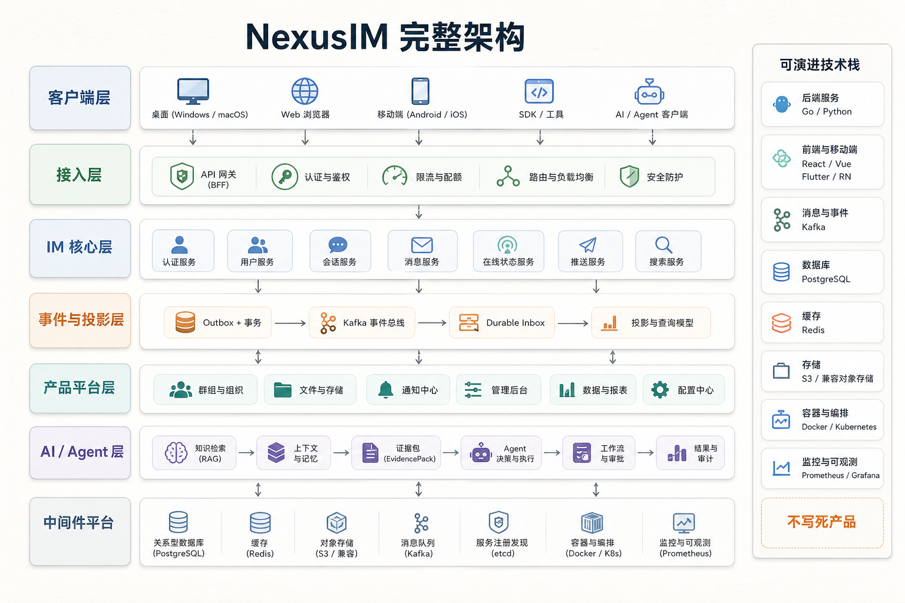
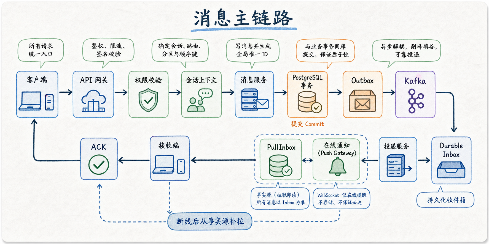
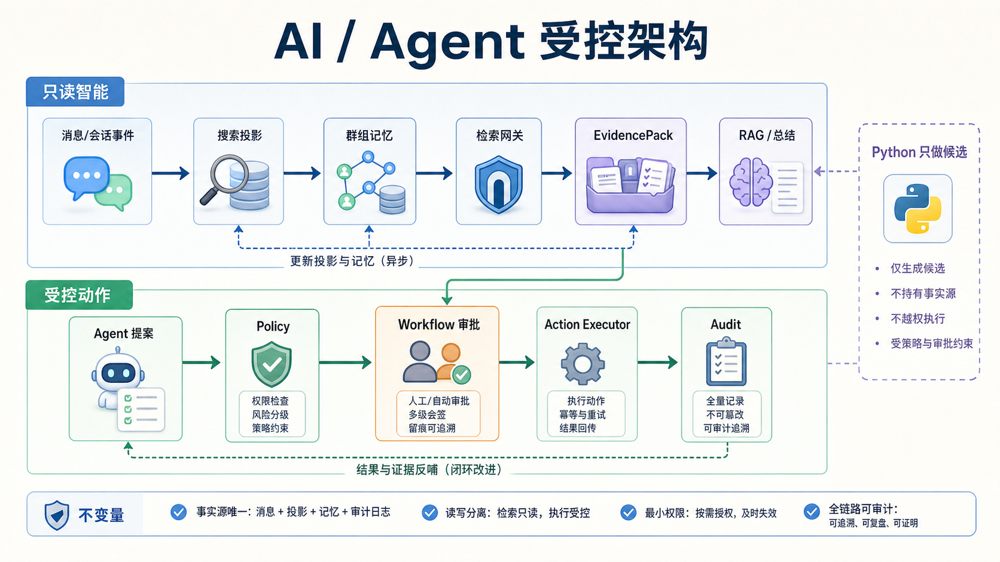
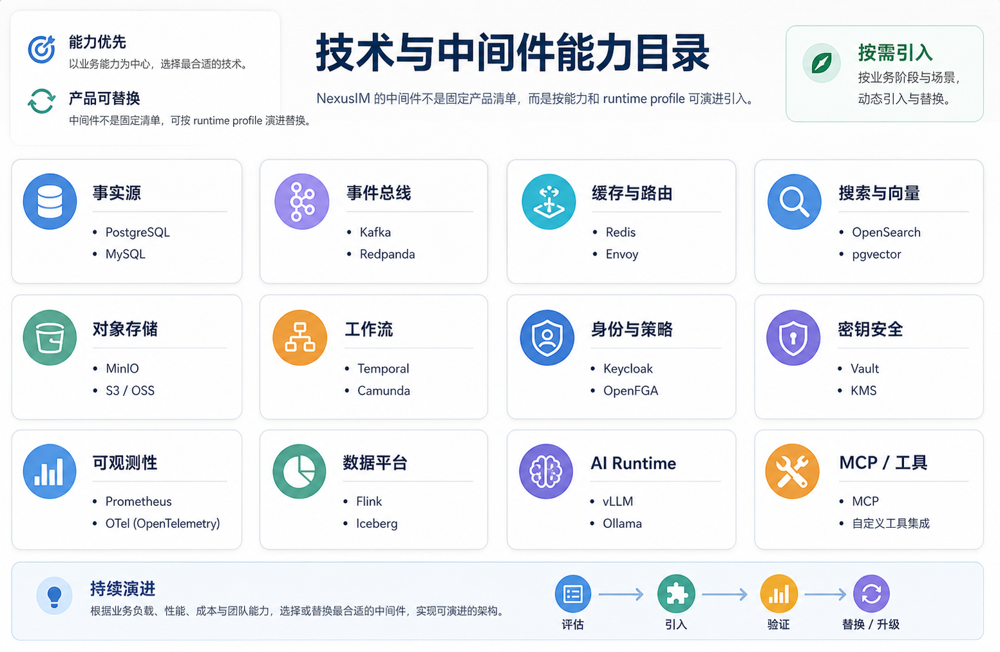
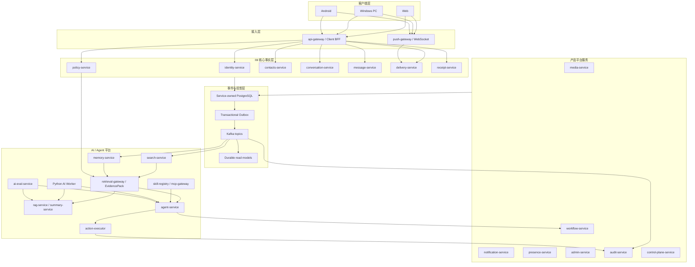

# NexusIM

NexusIM 是面向企业协同场景的分布式 IM + AI 协作平台。当前仓库已经从普通 IM demo 推进到：

```text
本地 / 双机可运行的分布式 IM 后端
-> Web / Windows PC / Android client platform first slice
-> group memory / EvidencePack / RAG / summary / Agent 应用底座
-> skill registry / MCP gateway / action executor / proposal approval / audit
-> 完整目标架构：业务平台 + 数据平台 + AI / Agent 平台 + 中间件平台
```

GitHub 首页只放当前总览。Codex 目标框正文只保存在目标框本身，不在仓库里重复维护；
每轮继续开发时按 [prompt.md](prompt.md) 和 [agent.md](agent.md) 路由读取
[current-goal.md](docs/runbook/current-goal.md)、[current-brief.md](docs/runbook/current-brief.md)
和 [remaining-goals.md](docs/runbook/remaining-goals.md)。

长期完整架构以 [target-architecture-complete.md](docs/architecture/target-architecture-complete.md)
为准。后续新增业务服务、数据平台服务、AI / Agent 服务或中间件时，都要按这份蓝图的
所有权、事件、数据、安全和演进规则推进；中间件能力登记见
[middleware-catalog.md](docs/platform/middleware-catalog.md)。

README 是 GitHub 首页和面试前快速入口，必须跟随当前开发进度维护。凡是 active slice、
服务 promotion、客户端能力、AI / Agent 平台边界或“下一步”发生实质变化，都要同步
更新本文件；长历史证据仍放 `docs/runbook/loadtest/` 和 `docs/runbook/archive/`。

## 当前架构设计

NexusIM 当前按“事实源清晰、事件驱动、读模型独立、AI 受控执行”的方式组织。根 README
只放架构总览；完整分层、数据平台和 AI / Agent 设计见
[target-architecture-complete.md](docs/architecture/target-architecture-complete.md)。

### 中文架构示意图

下面几张图用于快速讲解架构设计，采用白皮书 / 白板风格，不作为精确接口契约；
精确的服务边界、字段、事件和运行门禁以本文表格、SDD、ADR 和 runbook 为准。











### 分层职责

| 层级 | 当前设计 |
| --- | --- |
| 客户端层 | Web / Windows PC / Android 共用 TypeScript `protocol` 和 `client-core`；native shell 只做薄平台 bridge。 |
| 接入层 | `api-gateway` 提供 client BFF、鉴权、quota、trusted metadata；`push-gateway` 只做在线唤醒，不拥有 durable inbox。 |
| IM 核心层 | 9 个 IM 服务分别拥有身份、策略、联系人、会话、消息、投递、回执等事实和读模型。 |
| 事件与投影层 | 每个服务拥有自己的 PostgreSQL schema；跨服务事实传播走 outbox -> Kafka -> projection / worker。 |
| 产品平台层 | media、notification、audit、admin、control-plane、presence、workflow 等按独立数据模型和故障边界逐步 promotion。 |
| AI / Agent 层 | search / memory 产出可见投影，retrieval-gateway 构造 EvidencePack，RAG / summary / Agent 只能基于 EvidencePack 工作。 |
| Python AI Worker | 只做模型、算法、embedding、rerank、memory extraction、planner 和 eval 候选；Go 继续拥有权限、状态、审批、审计和持久化。 |
| 中间件平台 | PostgreSQL、Kafka、Redis、OpenSearch / vector store、对象存储、观测、安全组件、数据平台和 AI runtime 都按能力与 runtime profile 引入，不写死产品。 |

### 当前客户端状态

客户端当前停在 Web / Windows PC 可演示 MVP，Android、release signing、MSI / NSIS
installer、完整移动端发布、复杂 UI、完整媒体体验和深水区群管理全部后置。Web / PC
shell 已接账号登录、注册、好友申请、好友列表、点击好友发起私聊、群聊列表、建群、
点击群聊进入会话、群成员添加 / 退群、从好友列表邀请入群、成员列表、成员搜索 /
角色过滤 / 分页、移除成员、角色变更 / owner transfer 第一路径、群资料卡、邀请来源提示、
权限感知群设置操作区、群标题 / 头像 URI / 群公告 read-update、群头像上传 / 展示 first
path、会话置顶 / 免打扰、归档、标签、草稿、会话筛选、消息列表、发送后本地状态刷新、
PullInbox 和 ACK。

2026-06-23 的 clean smoke 已验证双用户好友直聊、群聊 first path、群资料 BFF
read/update、群成员动作、群公告和群头像上传 / 展示 first path。多用户 UI smoke 已从低敏
计划生成推进到显式 opt-in 的真实浏览器 / PC runner：两个隔离 Chromium profile 经 CDP
驱动 Web shell 登录 sender / receiver、点击好友发起直聊、UI 建群、邀请成员、群聊发送、
会话标签 / 草稿 / 归档 / 筛选、PullInbox 和 ACK；clean commit `8782936b`、
`7e8a890b` 和 `05b8aec6` 已分别覆盖 direct / group / invite、会话管理 round-trip
和筛选匹配 / 排除路径。2026-06-23
`client-demo-mvp-browser-ui-20260623-231711` 追加验证 direct chat、group chat、
group invite、conversation management 和 receiver ACK 全部为 true。

Windows desktop 已有 standalone exe package、package-local README / launcher support files、
unsigned local portable zip bundle、desktop installer / signing readiness plans、desktop signing
readiness report、显式 signing wrapper、只读 signature verifier、post-build installer 签名验证、
installer build 包装器和本地开发签名 smoke。这些保留为后置 release backlog；当前演示只要求
Windows PC shell 能打开并展示 IM 主链路。2026-06-23
`client-demo-mvp-desktop-login-20260623-232819` 已通过 Windows desktop WebView
登录级真实 smoke，覆盖登录、push、direct conversation 外部消息触发、PullInbox、消息观察、
AckDelivery 和 `tauri-sqlite` native store readiness。

本地调试入口：

```powershell
.\clients\start-local-backend.ps1
.\clients\start-local-web.ps1
```

客户端仍只连接 `api-gateway` BFF 和 `push-gateway`，不直连内部服务；PullInbox 是
消息展示事实源，WebSocket 只做在线唤醒。

### 当前技术 / 中间件能力目录

NexusIM 的中间件和技术栈会随着功能持续增加。README 只记录当前判断和引入规则，
不是终局清单；新增或替换中间件时必须同步
[middleware-catalog.md](docs/platform/middleware-catalog.md)、对应 SDD / ADR、runtime
profile 和最小 smoke。

| 能力 | 当前已用 / 已有路径 | 后续可替换或增强方向 | 边界 |
| --- | --- | --- | --- |
| 交易事实源 | PostgreSQL；每个服务拥有自己的 schema 和 migration | 云 PostgreSQL、分片、只读副本、HA / failover | 业务事实归服务所有，不跨服务读私表。 |
| 事件传播 | Kafka + protobuf schema + transactional outbox relay | Schema Registry、AsyncAPI / CloudEvents 元数据、Pulsar 候选 | Kafka 是传播面，不是权威事实源。 |
| 临时状态 / 路由 / 缓存 | Redis single / Sentinel / Cluster；push route、resume、quota / presence 场景 | Redis Cluster 深化、托管 Redis、局部内存 cache | Redis 不保存 durable business facts。 |
| 搜索 | search-service projection；当前以服务内 adapter / PostgreSQL first path 为主 | OpenSearch、Elasticsearch、Meilisearch | 只有 search-service 写搜索索引。 |
| 向量索引 | vector-index-service；PostgreSQL metadata、pgvector optional adapter、embedding queue | Milvus、Qdrant、Weaviate、OpenSearch vector | 向量是可重建 projection，不是消息事实源。 |
| 对象存储 / 媒体 | media-service fake object-store port；Web / PC 群头像上传 / 展示 first path；MinIO / S3-compatible 预留 | S3、MinIO、Ceph、病毒扫描、缩略图、转码 provider | 二进制不放 message-service。 |
| 工作流 / 审批 | workflow-service 内部状态机、compensation instruction registry | Temporal、Cadence、Argo Workflows | 审批和补偿审计归 workflow / audit 所有。 |
| 身份 / 联邦 | identity-service、JWKS、OIDC discovery first path | Keycloak、OIDC providers、多 issuer、WebAuthn/passkeys | api-gateway 仍负责 trusted metadata 边界。 |
| 策略 / ReBAC | policy-service、tool policy precheck、关系投影 first path | OpenFGA、OPA、DSL / quota 策略中心 | 外部策略引擎只能作为 adapter，不能绕过 policy-service。 |
| 密钥 / 机密 | 本地 env / 文件 guard；生产语义已预留 | Vault、云 KMS、HSM、密钥轮换 | secret 不写入 docs、metrics、报告或事件 payload。 |
| 可观测性 | `/metrics`、Prometheus rules、Grafana dashboard、OTel first-stage wiring | OTel Collector、Loki、Tempo、Alertmanager、SLO / retention | 本地观测是开发证据，不等于生产 SLO。 |
| 数据平台 | 当前仍是目标架构能力；公开事件 / CDC 消费边界已定义 | Debezium、Flink、Iceberg、Delta、Trino、ClickHouse / Doris | 数据平台不能成为业务 command 写入口。 |
| AI runtime | model-gateway、Python AI Worker、mock / guarded external HTTP provider | OpenAI / Claude / 本地模型、vLLM、Ollama、Triton、LiteLLM | 业务服务不直连模型 provider。 |
| 图 / 知识关系 | memory-service 结构化 memory、source refs、supersedes、profile aggregate | Neo4j、图投影、关系图索引 | 只有关系查询收益明确时才引入独立图能力。 |
| MCP / 工具 | skill-registry、mcp-gateway prepare、action-executor | 更多 MCP tool servers、外部业务工具 | 工具调用必须经过 skill metadata、policy、approval 和 audit。 |

### 关键链路

```text
发消息：
client -> api-gateway -> policy-service -> conversation-service -> message-service
-> PostgreSQL message_log + message_outbox -> Kafka conversation.timeline.events
-> delivery-service projection -> user_inbox -> PullInbox / AckDelivery
-> delivery_outbox -> im.delivery.events -> push-gateway online notify
```

```text
AI / RAG / Agent：
message / conversation / policy events -> search-service + memory-service projections
-> retrieval-gateway policy check + visibility filter + EvidencePack
-> rag-service / summary-service answer with citations
-> agent-service proposal
-> workflow approval
-> action-executor approved action
-> audit-service durable audit
```

### 架构原则

- 不跨服务读私有表；跨服务只走公开 API、事件或明确 port。
- 业务事务不直接 publish Kafka；统一走 transactional outbox。
- 客户端展示消息以 `PullInbox` 为事实源，WebSocket 只做在线通知。
- RAG / summary / Agent 不能直接读 message / conversation 私表，只能消费权限过滤后的 EvidencePack。
- Agent 真实写动作必须经过 policy、proposal、approval、action-executor 和 audit。
- 新服务和中间件不写死，必须满足独立数据模型、独立伸缩、独立故障边界、独立安全边界或明显降低复杂度。
- 每个新功能先做简短架构分析，再编码；先确认 owner、数据所有权、API / 事件、
  权限 / 审计、是否需要新技术 / 新中间件 / 新 provider、平台归属和文档影响。
- 新增中间件进入中间件平台；数据处理进入数据平台；模型、向量、检索、RAG、
  Agent 和 Python worker 进入 AI / Agent 平台；客户端交互进入客户端平台；
  业务产品能力进入业务 / 产品平台；运维控制能力进入 ops / control-plane 平台。
- 开发相关路径时持续清理不符合 fail-closed policy 的隐藏备用路径；新代码不得新增
  隐藏业务备用路径。

## 当前状态

已进入真实链路的 9 个 IM 后端服务：

| 服务 | 作用 |
| --- | --- |
| `api-gateway` | 外部入口、认证透传、租户 quota、legacy descriptor 迁移门禁。 |
| `identity-service` | 登录、Refresh、MFA、recovery code、JWKS、challenge delivery。 |
| `message-service` | 发消息、编辑 / 撤回 / 删除、timeline / outbox。 |
| `conversation-service` | 会话、成员边界、owner transfer、发送上下文。 |
| `delivery-service` | durable inbox、`PullInbox`、`AckDelivery`、delivery outbox。 |
| `push-gateway` | WebSocket 在线通知、Redis route、resume / PullInbox recovery。 |
| `receipt-service` | 已读 / 送达回执、会话列表、未读 / 置顶 / 静音等读模型。 |
| `contacts-service` | 联系人请求、隐私策略、分组 / 搜索、来源风险。 |
| `policy-service` | 策略决策、ReBAC first path、moderation、tenant quota、tool policy precheck。 |

已启动并持续推进的 AI / Agent 应用底座：

| 服务 / 模块 | 当前状态 |
| --- | --- |
| `search-service` | 搜索 projection、visibility / tombstone、`SearchMessages`、timeline consumer、projection smoke。 |
| `memory-service` | group memory projection、rules-v0.2 extraction cue classifier、StructuredMemoryEvent、source refs、visibility window、revoke hidden、profile aggregate recompute / archive first path，以及公开 candidate submit / review / approve / reject / supersede temporal update 持久化路径。 |
| `retrieval-gateway` | EvidencePack 统一边界，聚合 search / memory / vector / policy precheck，并通过 memory-service 公开 API 扩展 current memory graph edges、depth=1 相邻 memory 和当前用户 profile aggregate evidence；当前策略版本 `retrieval-gateway.v1.hybrid-source-vector-rrf-graph-depth1` 会按 lexical search、vector item、memory event、profile aggregate、source chain、memory graph、actor attribution 和 profile support lane 做 RRF 风格融合，再叠加 source-chain 信号；vector source 只消费 vector-index-service 公开 `SearchVectors` 返回的低敏引用 / hash / visibility metadata，不传 raw text 或 embedding vector；已通过 focused retrieval / downstream checks，下一步做真实 vector backend live smoke；不直接调用 LLM。 |
| `rag-service` | 只读问答 first path、EvidencePack citation verifier、guarded external HTTP LLM boundary，并保留 EvidencePack memory graph edges 和 profile aggregate evidence；`loadtest/ragagent` 会把 RAG grounded answer 与 Agent approval / action audit 汇总成低敏演示报告。 |
| `summary-service` | 只读摘要 first path、EvidencePack citation verifier、guarded external HTTP LLM boundary，并保留 EvidencePack memory graph edges 和 profile aggregate evidence。 |
| `agent-service` | proposal-only path、mcp-gateway prepare、approval workflow、approval outbox relay、planner Python candidate guard，并保留 EvidencePack memory graph edges 和 profile aggregate evidence；`loadtest/ragagent` 复用 Agent proposal / approval / action-executor audit 校验。 |
| `skill-registry` | 技能目录、输入输出合约、风险等级、审批要求和审计元数据。 |
| `mcp-gateway` | tool prepare 边界、skill catalog check、policy precheck、低敏 audit，不直接执行外部工具。 |
| `action-executor` | approved execution audit、proposal / approval / prepare audit 校验、本地安全 adapter、guarded external HTTP provider adapter、eval smoke。 |
| `ai-eval-service` | 低敏 eval catalog / recorder / gate；case catalog 81，profile-Agent safety fixture 20，memory-service / retrieval-gateway / RAG / Summary / Agent live adapters 已完成第一轮 service-stack gate，覆盖 collaborative memory、profile aggregation、public candidate review / temporal update、profile repair approval、EvidencePack、Agent output 和 action safety；retrieval positive adapter 已通过 source-chain rerank live gate，确认 multi-source memory evidence rerank 优先级；`rag-agent-demo` 已通过 optional service-stack live gate，确认 RAG grounded answer、Agent approval、profile repair workflow approval、group-memory answer / proposal、business proposal source-chain 和 action-executor audit 主线。 |
| `ai/python` | Python AI Worker 候选层：contract guard、低敏 safety guard、candidate-only worker CLI、memory extraction hash-only candidate first path、`IM` conda toolchain。 |

已进入 product-active first-stage 的平台 / 产品服务：

| 服务 | 当前状态 |
| --- | --- |
| `media-service` | 上传会话、完成上传、资产查询、下载 URL、删除、media outbox relay、mock processing worker first path；本地 fake object HTTP adapter 已支撑 Web / PC 群头像上传 / 展示 first path。 |
| `notification-service` | 通知请求事实源、状态查询、取消、accepted outbox、notification outbox relay、noop / webhook delivery worker first path。 |
| `audit-service` | append / query、hash-chain proof、admin-event ingestion、first-stage export job metadata。 |
| `admin-service` | 管理操作创建 / 审批 / 查询、operation worker、outbox relay、control-plane / audit adapter、workflow compensation request handoff。 |
| `control-plane-service` | config publish / rollback / snapshot / ACK、DB-backed quota / feature snapshot。 |
| `presence-service` | `UpdatePresence`、`GetPresence`、`UpdateTyping`、PostgreSQL presence projection、低敏 presence outbox。 |
| `model-gateway` | text generation / embedding invocation metadata、mock provider、低敏 invocation outbox，不持久化 raw prompt 或 embedding vector。 |
| `knowledge-ingestion-service` | knowledge source、ingestion job、chunk manifest、knowledge outbox relay、vector handoff first path。 |
| `workflow-service` | workflow creation / decision、approval状态机、compensation request / instruction registry / rollback adapter first path。 |
| `vector-index-service` | vector metadata、tombstone、search、rebuild request / checkpoint、embedding queue / worker、knowledge chunk consumer first path。 |

已启动的客户端平台：

| 模块 | 当前状态 |
| --- | --- |
| `clients/` | Browser / Windows PC / Android client platform first slice：`protocol`、`client-core`、Web shell、PC desktop shell contract 和 Android runtime contract 已建立并通过 focused validation；`api-gateway` client BFF first-stage HTTP/JSON surface 已落；Web / PC shell 已接账号密码登录、注册、好友列表、好友申请、点击好友发起私聊、群聊列表、建群、点击群聊进入会话、群成员添加 / 退群、从好友列表邀请入群、成员列表、成员搜索 / 角色过滤 / 分页、移除成员、角色变更 / owner transfer 第一路径、群资料卡、邀请来源提示、权限感知群设置操作区、群标题 / 头像 URI / 群公告 read-update、群头像上传 / 展示 first path、会话置顶 / 免打扰、归档、标签、草稿、会话筛选、消息列表、发送后本地状态刷新、PullInbox / AckDelivery；真实双用户 direct + group client smoke 已通过；`plan:browser-multiuser-ui-smoke` 可从成功的 `client-web-summary.json` 生成低敏浏览器 / PC 多用户 UI smoke 计划；`smoke:browser-multiuser-ui` 已提供显式 opt-in 的真实浏览器 / PC runner，使用两个隔离 Chromium profile 驱动 sender / receiver 完成直聊、UI 建群、邀请成员、群聊、会话标签 / 草稿 / 归档、tag / draft / archived-only 筛选、PullInbox 和 ACK；2026-06-23 已在 clean commit `8782936b` 实跑通过 direct / group / invite 路径，在 clean commit `7e8a890b` 实跑通过会话管理 round-trip，并在 clean commit `05b8aec6` 实跑通过会话筛选匹配 / 排除路径；默认 smoke 不启动浏览器；PC standalone exe、package-local README / launcher support files、unsigned local portable zip bundle、desktop installer / signing readiness plans、desktop signing readiness report、显式 `--execute` 门控 signing wrapper、只读 signature verifier、post-build installer 签名验证、显式 `--execute` 门控 installer build 包装器和 Android debug APK baseline 已产出；artifact install / signing / verification / installer plans 已按 `artifactKind` 区分 executable / installer，不把 installer 当作 portable direct-launch 输入，也不把 mixed manifest 里的 installer 当作 MSI / NSIS executable baseline，并且未通过只读 Authenticode 验证的 installer 不会被标为 install-ready。客户端只连 `api-gateway` / `push-gateway`，PullInbox 是消息事实源，WebSocket 只做在线唤醒。 |

当前默认主线不是继续泛化清理 9 服务 P2 backlog，也不是做生产级 HA 长测或完整客户端产品化。
Web / Windows PC 客户端已经足够作为演示入口：账号注册登录、好友关系、好友私聊、
群聊、中文消息、消息列表、发送、PullInbox / AckDelivery、push 状态和局域网可运行体验已有
第一阶段证据。下一步主线切回后端架构完善和 AI / Agent / RAG 演示链路。
Windows signed installer / MSI / NSIS、真实 signing input、Android 真机 smoke、正式移动端发布、
入群审批 / 禁言等深水区群设置和真实 media provider 链路全部后置。

AI 大模型应用底座作为后续主线保留：

```text
group memory
-> EvidencePack
-> RAG / summary
-> multi-agent
-> skill-registry
-> MCP/tool gateway
-> action-executor
-> proposal / approval / audit
-> ai-eval
```

当前 AI eval 已把 collaborative memory 的 multi-hop actor chain、workstream /
decision dependency edge、reviewed multi-source profile activation 和
supporting-memory delete 后 profile recompute 纳入低敏 fixture gate，并完成
memory-service / retrieval-gateway optional live adapter first pass；RAG /
Summary / Agent live adapters 也会断言 multi-hop actor/source-chain
completeness。2026-06-24 `ai-eval-service-stack-live-20260624-collab-memory-v4`
先通过完整 live service-stack gate：8 adapters、51 cases、47 passed、0 failed、
4 skipped；随后 `ai-eval-service-stack-live-20260624-retrieval-negative`
补齐 retrieval-gateway negative / miss adapter，达到 9 adapters、51 cases、
51 passed、0 failed、0 skipped。新增覆盖 empty memory source coverage、
superseded memory 排除、source ref / dedupe reason 和 cross-tenant evidence
isolation。2026-06-24 追加 EvidencePack memory graph edge 扩展：
retrieval-gateway 通过 memory-service 公开 `GetMemoryEvent` 读取 current memory
graph edges，并把 `EvidenceMemoryGraphEdge` 透传给 RAG / Agent；retrieval /
RAG / Agent loadtest 都会断言跨群 source refs 与 `SUPPORTS` graph edge 被保留。
同日追加 graph expansion depth=1：retrieval-gateway 会沿当前 memory hit 的 graph
edge 通过 memory-service 公开 API 拉取相邻 memory event，在 rerank / limit 截断前
纳入 EvidencePack 候选；相邻 memory 必须满足当前 memory status 过滤，lookup /
visibility / malformed edge 失败时 fail-closed。
同日追加 EvidencePack profile aggregate evidence：retrieval-gateway 通过
memory-service 公开 `ListProfileAggregates` 查询当前用户 ACTIVE profile aggregate，
并作为 `PROFILE_AGGREGATE` evidence 透传给 RAG / Summary / Agent；retrieval /
RAG / Agent loadtest 都会断言 profile subject、aggregate type/key、supporting
memory ids 和 source coverage 被保留。随后 memory-service 公开
`RecomputeProfileAggregate` first path：profile evidence 由多个可见 ACTIVE /
APPROVED `PROFILE_SIGNAL` memory events 重算，支持数量不足时归档旧 profile，
避免 deleted / rejected support 继续进入 EvidencePack；memory-service live adapter
已把该行为登记为 `must_recompute_profile_via_public_api` 断言。`loadtest/memoryprofile`
提供 first-stage profile repair operator，默认 plan-only，显式 `--execute` 才调用公开
recompute RPC，报告只输出低敏 hash / count。
memory-service timeline worker 同步升级到 `rules-v0.2` group memory extraction：
只抽取明确 `decision:` / `task:` / `status:` / `blocker:` / `file:` /
`profile_signal:` 等 cue 或显式 memory metadata 的消息；普通聊天不会被泛化成
memory fact，profile / preference / role signal 保持 PENDING + NEEDS_REVIEW。
Python memory extraction candidate first path 和 Go-side adapter 已接入
memory-service 的公开 candidate review path：`SubmitMemoryCandidate` 校验
source refs 可见性与 `fact_sha256`，只写入 `PENDING + NEEDS_REVIEW`；
`ReviewMemoryCandidate` 才能显式 approve / reject。`loadtest/memory` 和
memory-service ai-eval adapter 已把该路径纳入 public API 检查。
`loadtest/ragagent` 已新增 RAG-Agent demo first path：编排既有 `loadtest/rag`
和 `loadtest/agent`，围绕同一 tenant / conversation 生成低敏总报告，断言
RAG grounded answer、Agent proposal、approval、action-executor audit、
EvidencePack graph edges 和 profile evidence 均成立；报告只保存 hash、计数和状态，
不保存 raw answer / proposal text。`rag-agent-demo` 已接入 ai-eval optional
service-stack adapter、gate policy 和 service-stack 路由；2026-06-24
`ai-eval-rag-agent-demo-live-20260624-current-image-fixed` 已通过真实服务栈运行并归档报告。
随后 `ai-eval-rag-agent-demo-live-20260624-public-candidate-review-v3` 进一步确认
memory-service 公开 candidate review / approval path 产生的 `ACTIVE + APPROVED`
memory 会进入 RAG / Agent EvidencePack。`ai-eval-rag-agent-demo-live-20260624-temporal-update-v2`
继续把 public candidate replacement 接入同一链路：新 candidate 经公开审批后
supersede 旧 memory，旧 memory 变为 `SUPERSEDED`，RAG / Agent EvidencePack 只保留
当前 `ACTIVE + APPROVED` replacement。`ai-eval-rag-agent-demo-live-20260624-profile-repair-approval-v3`
已把 profile repair approval 接入真实 service-stack gate：profile signal candidate
经公开 submit / review 后，必须创建并审批 workflow-service `REPAIR_APPROVAL`，再通过
memory-service 公开 `RecomputeProfileAggregate` 执行 batch recompute；修复后的 profile
aggregate 同时进入 RAG / Agent EvidencePack。该轮还修复了 memory-service 对既有
non-deterministic `profile_id` 但 subject/type/key 相同的 profile aggregate 重算唯一约束问题。
`ai-eval-rag-agent-demo-live-20260624-group-memory-answer-proposal-gate-v1` 已归档：
`DECISION` / `BLOCKER` / `FILE` 三类 reviewed group memory 同时进入 RAG answer 和
Agent proposal EvidencePack，并保留 source refs / cross-group source refs。
`ai-eval-rag-agent-demo-live-20260624-business-proposal-source-chain-gate-v1` 进一步确认：
`DECISION` / `TASK` / `STATUS` 三类 reviewed memory 可驱动
`conversation.note.create` 业务 proposal，经 approval 后由 action-executor 记录 audit；
未配置真实 mutation adapter 时必须不执行业务写动作。

下一步默认看 [current-goal.md](docs/runbook/current-goal.md)。截至当前主线，客户端只修
阻塞演示入口的问题；默认推进
`IM 消息 -> search / memory projection -> EvidencePack -> RAG / Agent answer -> approval / audit`。
Windows release signing、MSI / NSIS installer、
Android APK / 真机 smoke、完整媒体体验和深水区群管理均不作为当前默认阻塞。

## 不变量

- PostgreSQL 是交易事实源；Kafka 是事件传播面；业务事务不能直接 publish Kafka，必须走 outbox relay。
- RAG / summary / Agent 只能消费 EvidencePack，不能直接读 message / conversation / private tables。
- Agent 写动作必须走 policy、tool policy、proposal、approval、action-executor 和 audit。
- Python 只做 LLM / embedding / rerank / memory extraction / planner / eval 候选层；Go 负责控制面、权限、状态、审计和持久化。
- push-gateway 不拥有 durable inbox；断线和慢连接恢复以 delivery-service `PullInbox` 为准。
- 新服务和中间件不写死；只有当独立数据模型、伸缩、故障、安全边界或复杂度收益成立时才通过 ADR 新增。
- 新功能、新服务和新中间件先做架构分析再编码，并同步 README、目标架构、
  service brief、SDD / ADR、middleware catalog 和进度文档中的相关事实。
- 不新增隐藏兜底路径；触达相关旧路径时优先删除或改成显式 fail-closed、
  retry / repair / redrive / local-test adapter。
- 压测 / smoke 原始输出放 `H:\NexusIM\loadtest-results`，仓库只保存低敏报告、summary 和索引。

## 目录结构

| 目录 | 作用 |
| --- | --- |
| `api/` | 同步接口契约。`api/proto/` 存放 gRPC Protobuf。 |
| `schemas/` | 异步事件契约。`schemas/kafka/` 存放 Kafka topic 的 Protobuf schema。 |
| `services/` | Go 服务实现。每个服务统一使用 `api / app / domain / infrastructure / types / trigger` 六层目录。 |
| `ai/python/` | Python AI Worker 候选层代码和 `IM` conda 环境配置。 |
| `migrations/` | PostgreSQL migration，按服务归档。 |
| `deploy/` | 本地 Docker、观测、服务编排和运行配置。 |
| `loadtest/` | smoke / loadtest runner。原始结果默认写到 H 盘。 |
| `docs/` | 架构、SDD、ADR、runbook、面试叙事和证据索引。 |
| `tools/` | 生成、门禁、smoke、evidence manifest、capacity / observability 辅助脚本。 |

## 文档入口

| 文档 | 用途 |
| --- | --- |
| [prompt.md](prompt.md) | Codex 文档路由入口；不保存目标框正文。 |
| [agent.md](agent.md) | Codex / sub-agent 每轮读取和维护文档的路由规则。 |
| [docs/runbook/current-brief.md](docs/runbook/current-brief.md) | 低 token 当前阶段入口。 |
| [docs/runbook/current-goal.md](docs/runbook/current-goal.md) | 当前 active slice。 |
| [docs/runbook/development-progress.md](docs/runbook/development-progress.md) | 当前开发进度总览。 |
| [docs/runbook/remaining-goals.md](docs/runbook/remaining-goals.md) | 只记录还没有完成的工作。 |
| [docs/runbook/service-briefs/README.md](docs/runbook/service-briefs/README.md) | 服务 brief 索引。 |
| [docs/architecture/target-architecture.md](docs/architecture/target-architecture.md) | 总体目标架构。 |
| [docs/architecture/target-architecture-complete.md](docs/architecture/target-architecture-complete.md) | 完整目标架构蓝图：业务平台、数据平台、AI / Agent 平台、中间件平台和演进路线。 |
| [docs/architecture/target-architecture-ai.md](docs/architecture/target-architecture-ai.md) | AI / RAG / Agent 目标架构。 |
| [docs/platform/middleware-catalog.md](docs/platform/middleware-catalog.md) | 中间件能力分类、runtime profile 和引入规则。 |
| [docs/runbook/ai-eval/README.md](docs/runbook/ai-eval/README.md) | AI eval case schema、adapter 和运行入口。 |

## 六层 DDD 约束

服务目录统一为：

```text
services/<service-name>/
  cmd/
  internal/
    api/
    app/
    domain/
    infrastructure/
    types/
    trigger/
```

允许依赖方向：

```text
api -> app/types
trigger -> app/types
app -> domain/infrastructure/types
domain -> types
infrastructure -> domain/types
```

禁止方向：

```text
domain -> infrastructure/api/trigger
infrastructure -> api/trigger
types -> app/domain/infrastructure/api/trigger
```

说明：

- `api` 只做 gRPC/HTTP 适配和 request/response 转换。
- `app` 编排 use case、事务和 port。
- `domain` 表达领域规则，不依赖 SQL、Kafka、Redis 或外部 SDK。
- `infrastructure` 实现 PostgreSQL、Kafka、Redis、外部 RPC client 和 provider adapter。
- `trigger` 放 outbox relay、Kafka consumer、定时巡检和补偿任务。

## 常用命令

生成 Protobuf：

```powershell
. .\tools\go-env.ps1
.\tools\gen-proto.ps1
```

启动 / 停止本地依赖：

```powershell
make local-up
make local-down
```

运行聚焦 Go 测试：

```powershell
. .\tools\go-env.ps1
go test ./services/action-executor/... -count=1
```

使用 Python AI Worker 环境：

```powershell
conda activate IM
cd ai\python
python -m pytest
python -m ruff check .
python -m mypy nexusim_ai_common scripts tests
```

运行当前 AI eval adapter：

```powershell
. .\tools\go-env.ps1
.\tools\validate-ai-eval-cases.ps1
.\tools\run-ai-eval-action-external-adapter.ps1
.\tools\run-ai-eval-profile-agent-safety.ps1
```

完整本地门禁只在跨服务、生成代码、migration、service-registry、Docker/compose、安全边界或提交推送前需要：

```powershell
.\tools\check-local.ps1
```

## 当前不是已完成项

以下内容仍属于后续 hardening 或产品化，不要在面试或文档里说成已经生产级完成：

- 生产级 Redis / Kafka / PostgreSQL HA、长时间 fault campaign、split-brain fencing、生产 sizing。
- 统一生产观测平台、Alertmanager 路由、日志汇聚、SLO 和长期 retention。
- provider-grade OIDC / KMS / HSM / email / SMS / WebAuthn / complete risk engine。
- provider-grade ReBAC DSL、外部 audit sink、运维 UI、批量 repair 审批系统。
- 完整 Web / App / 桌面客户端；当前 Web / Windows PC shell 已有账号登录、注册、好友、
  群聊、群成员添加 / 退群、从好友列表邀请入群、成员列表、成员搜索 / 角色过滤 / 分页、移除成员、角色变更 / owner transfer、
  群资料卡、邀请来源提示、权限感知群设置、群标题 / 头像 URI / 群公告 read-update、会话置顶 / 免打扰第一路径以及消息 first path，`api-gateway` client BFF first-stage surface、Web adapters first path、
  本地 / wired LAN smoke、BFF HTTP metrics / rate-limit adapter、PC standalone exe、
  package-local README / launcher support files、unsigned local portable zip bundle、desktop installer / signing readiness plans、desktop signing readiness report、独立 installer profile、显式 signing wrapper、只读 signature verifier、post-build installer 签名验证、显式 installer build 包装器、artifactKind-aware install / signing / verification / installer plans、installer install-ready Authenticode gate、Android debug APK baseline 已落，真实双用户 direct + group client smoke 和真实浏览器 / PC 多用户 UI smoke 已通过；当前只补演示阻塞。Windows signed installer / MSI / NSIS、真实 signing input、Android 真机 smoke、正式移动端发布、入群审批 / 禁言等更深群设置和真实 media provider 链路均后置。
- 完整 media / notification / admin / audit / workflow / control-plane 等产品化平台能力；
  当前这些服务已有 first-stage 路径，但 provider-grade adapter、UI、长周期运维和生产化
  仍未完成。

当前最准确表述：

```text
NexusIM 已完成 9 个 IM 后端服务的主链路和一批本地 / 双机分布式 smoke，
已形成 AI / RAG / Agent first-stage 应用底座和 product-active 平台服务 first paths，
Web / Windows PC 客户端已经满足当前演示入口标准。
当前主线切回后端架构完善和 AI / Agent / RAG。
```
