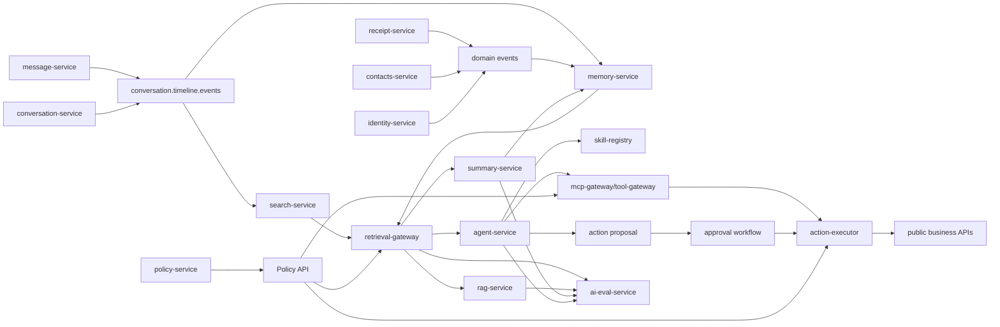

# NexusIM AI / Memory / Agent Target Architecture

本文规划 NexusIM 后续 AI 相关后端能力。它不是一次性全开工清单；短期不以生产级 HA、全量压测、混沌和跨 Region 验证作为继续推进的阻塞。当前 Agent Lab 的详细设计入口是 `docs/sdd/agent-platform.md`；第一阶段不接真实 IM 数据，而是先用公开数据集和 synthetic IM-like fixture 验证 Agent / RAG / memory / tool / workflow / eval 能力。本文用于保证后续 search、memory、retrieval、RAG、summary、Agent、tool 和 eval 能力不会各自长成孤岛。

## 1. 设计输入

EverMemBench 只是设计输入之一。它强调多人、多群、多时间版本协作记忆中容易失败的点：多人归因、跨群证据链、版本语义、隐式相关检索和长期画像聚合。NexusIM 的 AI 架构需要吸收这些问题，但不能只服务这一个 benchmark。

后续 AI 评测至少覆盖这些能力族：

| 能力族 | 关注点 |
| --- | --- |
| 长期协作记忆 | 多人、多群、多主题、跨时间版本、角色上下文 |
| 长期个人记忆 | 多 session、用户偏好、时间更新、abstention |
| 搜索与证据 | 关键词、结构过滤、向量召回、rerank、source attribution |
| 权限与安全 | 成员可见窗口、撤回/删除 tombstone、跨租户隔离 |
| 画像聚合 | 风格、技能、角色关注点，不把群事实误升为个人偏好 |
| Agent 写动作 | proposal、approval、executor、audit，禁止模型直接改事实源 |

### 1.1 设计不是单一论文驱动

后续 AI / Agent / RAG 会同时面对多类问题。架构必须抽象出共用底座，而不是为某个 demo 或某篇论文单独定制。

| 输入来源 | 对架构的要求 |
| --- | --- |
| 多人协作 memory benchmark | 需要 speaker / group / time / version / evidence attribution |
| 企业搜索和聊天记录检索 | 需要关键词、结构过滤、向量召回和权限过滤并存 |
| RAG 问答 | 需要 EvidencePack、citation、abstention 和 prompt/version 记录 |
| Agent 工具调用 | 需要 tool policy、proposal、approval、executor、audit 和 idempotency |
| 用户画像和个性化 | 需要长期聚合、支持证据、过期、撤销和用户控制 |
| 合规和安全 | 需要 tombstone、retention、legal hold、tenant isolation 和 delete proof |
| 生产运行 | 需要 projection rebuild、eval gate、成本治理、故障降级和可观测性 |

因此第一阶段先建设搜索、证据和权限底座；RAG、summary、Agent 都必须复用这条路径，不能各自绕开权限或重新发明检索链路。

## 2. 核心不变量

1. IM 业务事实源仍在现有服务：message、conversation、delivery、identity、contacts、policy 等服务继续拥有各自事实。
2. AI 服务只消费事件、构建 projection、生成证据包和建议，不直接改 IM 事实源。
3. 未来 AI 层服务拆分以 `search-service`、`memory-service`、`retrieval-gateway`、`rag-service`、`summary-service`、`agent-service`、`skill-registry`、`mcp-gateway/tool-gateway`、`action-executor` 为主线；`ai-eval-service` 第一阶段可以先作为 harness / gate 存在。服务和中间件不是写死终局。
4. 新增服务必须满足独立数据模型、独立伸缩需求、独立故障边界、独立安全边界之一，或显著降低复杂度，并通过 ADR。
5. Agent 可以接入真实业务，但不能直连 PostgreSQL、OpenSearch、Milvus、Redis；只能通过 retrieval-gateway、mcp-gateway/tool-gateway、action-executor 或公开业务 API。
6. Agent 写动作必须先做权限前置校验和 tool policy 检查；audit 是必要条件，但不能替代权限检查。
7. 高风险 Agent 写动作必须走 `Proposal -> Approval -> Executor -> Audit`；低风险 allowlist 动作可在 policy 通过后自动执行并完整 audit。
8. 搜索、RAG、summary、Agent 的任何回答都必须能关联 EvidencePack；没有证据时必须明确标记。
9. 成员 `join_seq / leave_seq`、消息撤回、删除、保留期清理和 legal hold 必须进入检索过滤。
10. 旧事实和新事实不能并列无版本地塞进向量库；必须有 `active / superseded / archived / deleted` 语义。

## 3. 分层服务规划

这些服务不是一次性全开工，也不是永久写死的服务数量。未来 AI 层以以下拆分作为目标基线；新增、合并或替换服务/中间件时，必须满足独立数据模型、独立伸缩需求、独立故障边界、独立安全边界之一，或显著降低复杂度，并通过 ADR。

| 层级 | 基线服务 | 责任 |
| --- | --- | --- |
| 搜索投影 | `search-service` | 消费 timeline 事件，构建可重建全文搜索 read model，处理 tombstone 和可见窗口 |
| 记忆投影 | `memory-service` | 抽取结构化协作事件、事实版本、人物/项目/任务图谱和画像聚合 |
| 检索入口 | `retrieval-gateway` | 统一结构过滤、BM25、向量召回、事件图扩展、rerank、EvidencePack |
| RAG 问答 | `rag-service` | 只消费 EvidencePack 和受控模型适配器，生成带 citation / abstention 的回答 |
| 摘要任务 | `summary-service` | 会话、项目、任务摘要和重算任务；摘要必须可追溯、可删除后重算 |
| Agent 编排 | `agent-service` | 计划、工具调用意图、proposal 创建、approval 等待、结果解释 |
| 技能目录 | `skill-registry` | 管理 skill/tool 元数据、schema 版本、owner、风险级别和调用策略 |
| 工具网关 | `mcp-gateway/tool-gateway` | MCP / 内部工具调用入口、schema 校验、tool policy、速率限制和审计引用 |
| 动作执行 | `action-executor` | 只执行低风险 allowlist 或已审批动作，通过公开业务 API 写入并保证幂等 |
| AI 评测 | `ai-eval-service` | 版本化数据集、oracle evidence、权限回归、模型/prompt/retrieval/tool 变更门禁 |

### 3.1 非目标

后续实现时不要把下面能力塞进第一版：

- 不让 `message-service` 或 `conversation-service` 直接写搜索 / 向量库。
- 不让 `agent-service` 直接读业务库或直接执行写动作。
- 不把 RAG 做成“聊天记录全量塞进 prompt”。
- 不把向量库当唯一记忆源；结构化事件、关键词索引和权限投影必须并存。
- 不为了接一个模型 provider 提前固定全部模型、中间件或云厂商。
- 不把 AI 结果当业务事实源；AI 输出只能是建议、摘要、证据包或待审批动作。

### 3.2 Future AI-adjacent services

这些服务已经进入 future registry，但不在当前算法/eval 切片里直接落目录。
只有当现有服务内的 port / adapter 明显变复杂，或出现独立伸缩、故障、安全边界时才 promotion。

| 服务 | 触发拆分条件 |
| --- | --- |
| `model-gateway` | 多模型 provider、embedding / rerank、成本、recovery、prompt policy 和低敏审计需要统一治理 |
| `workflow-service` | Agent approval、repair、retention、外部补偿等长事务需要独立状态机 |
| `knowledge-ingestion-service` | 文件 / 网页 / 企业知识库导入、chunking、embedding pipeline 和导入审计独立成面 |
| `vector-index-service` | Milvus / pgvector / OpenSearch vector 写入、重建、backfill 和 delete proof 需要独立扩缩容 |

### 3.3 目标依赖图



关键点：

- Kafka 事实事件先驱动搜索和记忆 projection；RAG、summary、Agent 都复用 retrieval-gateway 生成 EvidencePack。
- retrieval-gateway 是所有检索的唯一入口。
- skill-registry 只管理技能/工具目录和 schema；mcp-gateway/tool-gateway 才是工具调用边界。
- policy-service 是检索、工具调用和 Agent 写动作的授权入口。
- action-executor 只能调用公开业务 API，不绕过 api-gateway / service boundary。

### 3.3 服务边界细化

| 服务 | 自有数据 | 输入 | 输出 | 禁止事项 |
| --- | --- | --- | --- | --- |
| `search-service` | search documents、search membership projection、index checkpoints | timeline / member / delete events | `SearchMessages`、index rebuild status | 不保存 LLM memory，不生成回答，不直写业务库 |
| `memory-service` | structured memory events、profile aggregates、memory graph checkpoints | message / conversation / identity / contacts / receipt / policy events | memory query、profile query、memory graph expansion | 不作为消息事实源，不替代 policy |
| `retrieval-gateway` | retrieval audit、EvidencePack | query、policy check、search/memory/vector recall | EvidencePack、ranked evidence | 不直接生成业务回答，不绕过 policy |
| `rag-service` | RAG session、answer audit、prompt version、model usage refs | user query、EvidencePack、model provider adapter | answer with citations / abstention | 不直接读索引，不无证据回答 |
| `summary-service` | summary jobs、summary versions、supporting evidence refs | schedule / user request、EvidencePack、message or memory changes | conversation / project / task summary | 不把 summary 当事实源，不绕过删除和可见性 |
| `agent-service` | agent run、plan、tool intent、proposal ref | user intent、EvidencePack、skill catalog | proposal、read-only answer、agent trace | 不直接写业务事实，不直接执行高风险 tool |
| `skill-registry` | skill metadata、tool schema、risk labels、owner refs | skill registration / version update | skill catalog、schema version、risk policy refs | 不执行工具，不保存业务事实 |
| `mcp-gateway/tool-gateway` | tool call audit refs、tool route config | tool intent、skill schema、policy decision | validated tool call、tool result ref | 不绕过 policy，不执行未注册或 schema 不匹配的 tool |
| `action-executor` | action attempts、idempotency ledger、execution result refs | low-risk allowlist action or approved proposal | execution status、business request id、audit refs | 不接收未授权高风险动作，不绕过公开业务 API |
| `ai-eval-service` | eval dataset/run/result | dataset、model/prompt/retrieval/tool versions | pass/fail、failure class | 不参与线上热路径 |

### 3.4 Python AI Worker Layer

Go 仍是 NexusIM AI 应用的控制面和事实边界；Python 只作为 AI Worker 层，
负责模型生态更强、迭代更快的候选生成和离线评测。Python worker 不是第二套
业务后端，不能直接写 IM 主库，不能绕过 policy / approval / audit。

默认调用形态：

```text
Go service
-> gRPC / HTTP / Kafka contract
-> Python AI worker
-> candidate result / model result / eval result
-> Go service validates, authorizes, audits, persists or rejects
```

Go 负责：

- 权限、租户隔离、用户 / device / agent identity；
- PostgreSQL 事务、outbox、Kafka 发布、DLQ / repair；
- EvidencePack 校验、citation verifier、tool policy、approval、audit；
- 公开 API、稳定错误码、metrics / tracing / operator。

Python worker 可以负责：

- LLM provider adapter、prompt 实验和 token budget 探索；
- embedding、rerank、cross-encoder、local model runtime；
- memory extraction candidate、profile aggregation candidate；
- planner / critic / verifier 原型；
- offline eval、benchmark、数据集处理和报告生成。

Python worker 禁止：

- 直接读写 message / conversation / delivery / identity / contacts / policy 私表；
- 直接持久化最终 memory、summary、answer、proposal、approval 或 execution state；
- 执行高风险业务动作或绕过 action-executor；
- 保存 raw prompt、raw provider body、secret、token 或完整敏感 payload；
- 将群聊单条内容直接升级为个人画像或 ACTIVE memory。

通信方式按场景选择：

| 方式 | 适用场景 | 必要边界 |
| --- | --- | --- |
| gRPC | 长期运行、低延迟 worker | protobuf contract、deadline、trace、稳定错误 |
| HTTP | 简单 provider adapter / 本地原型 | JSON schema、timeout、retry budget |
| Kafka | 异步 / 批处理 / 长任务 | task_id / result_id 幂等、DLQ、replay |
| CLI subprocess | 本地实验 / 一次性评测 | 不进入线上热路径 |

后续引入 Python 代码时推荐目录：

```text
ai/python/
  pyproject.toml
  README.md
  nexusim_ai_common/
    config.py
    logging.py
    tracing.py
    kafka.py
    grpc_client.py
    safety.py
  workers/
    llm_worker/
    embedding_worker/
    rerank_worker/
    memory_worker/
    planner_worker/
    eval_worker/
  contracts/
  scripts/
```

建议工具链：Python 3.12、`uv`、`pydantic`、`grpcio` 或 FastAPI、`pytest`、
`ruff`、`mypy`、OpenTelemetry；Kafka worker 可用 `aiokafka` 或
`confluent-kafka`。正式接入前必须有 ADR / SDD 指明调用方、契约、超时、
输出过滤、失败回退和 Go 侧拒绝 malformed / unsafe output 的测试。

## 4. 数据模型方向

### 4.1 RawEvent

RawEvent 来自现有 Kafka 事实事件和必要的消息元数据，不是新的事实源。

```text
tenant_id
conversation_id
conversation_seq
source_event_id
message_id
speaker_user_id
occurred_at
event_type
payload_ref
trace_id
```

### 4.2 SearchDocument

用于全文搜索和第一阶段检索。

```text
tenant_id
conversation_id
conversation_seq
message_id
speaker_user_id
searchable_text
status: active / edited / revoked / deleted
join_leave_visibility_version
source_event_id
updated_by_event_id
```

### 4.3 StructuredMemoryEvent

用于协作记忆，不等同于消息原文。

```text
memory_event_id
tenant_id
scope: conversation / project / personal / tenant
conversation_id
actors
topic
event_type: task / decision / update / blocker / file / status / preference / role_signal
fact
status: draft / active / superseded / archived / deleted
valid_from_seq
valid_to_seq
valid_from_time
valid_to_time
source_refs
supersedes
related_events
confidence
extraction_model_version
```

StructuredMemoryEvent 的写入规则：

- 每条结构化记忆必须引用至少一个 source event / message。
- `preference` 和 `role_signal` 不能从群聊单条消息直接升级为个人长期画像，必须进入 profile aggregation。
- `supersedes` 必须显式表达旧事实被新事实覆盖。
- `deleted` / `revoked` / retention cleanup 必须能反向影响 memory event 可见性。

### 4.3.1 Memory Graph

为了支持跨群、跨人、多跳和时间版本检索，memory-service 需要维护轻量事件图，而不是只维护向量。

```text
nodes:
  user
  conversation
  project/topic
  task
  decision
  file
  memory_event

edges:
  mentioned_by
  assigned_to
  supersedes
  blocks
  confirms
  revises
  belongs_to
  visible_in_window
```

第一版可用 PostgreSQL 表表达节点/边；后续如果图查询成为瓶颈，再通过 ADR 引入图数据库。

### 4.4 ProfileAggregate

画像是长期聚合，不是单条消息事实。

```text
tenant_id
subject_user_id
profile_type: style / skill / role_focus
aggregate_value
supporting_event_ids
valid_from
valid_to
confidence
last_recomputed_at
```

ProfileAggregate 的准入规则：

- 必须有多条 supporting evidence，或者有明确用户确认。
- 必须区分 `observed_style`、`declared_preference`、`inferred_skill`、`role_focus`。
- 必须支持撤销和过期；用户可要求清理或禁用画像。
- 画像只参与个性化和建议，不作为授权事实。

### 4.5 EvidencePack

所有 RAG / Agent 输出的可审计证据边界。

```text
evidence_pack_id
tenant_id
query_id
retrieval_strategy_version
items[]
  source_type: message / memory_event / profile / file
  source_id
  conversation_id
  conversation_seq
  source_event_id
  snippet
  score
  acl_version
  checksum
created_at
```

EvidencePack 的约束：

- 每个 item 必须有 `source_id`、`source_event_id` 或等价可追溯 id。
- 每个 item 必须有 ACL / visibility version。
- 如果 evidence 来自 profile aggregate，必须能追溯到 supporting events。
- 若 evidence 不足、互相冲突或权限不确定，RAG / Agent 必须 abstain 或进入 clarification。

### 4.6 ActionProposal

Agent 写动作只生成 proposal。

```text
proposal_id
tenant_id
requested_by_user_id
agent_id
action_type
target_resource
arguments_json
evidence_pack_id
risk_level
required_approvers
status: pending / approved / rejected / executed / failed / canceled
created_at
approved_at
executed_at
audit_event_id
```

### 4.7 AI Eval Dataset

```text
dataset_id
dataset_version
task_family
test_case_id
input_context_ref
question
expected_behavior
gold_evidence_refs
permission_context
oracle_evidence
labels: recall / temporal / profile / permission / agent_safety
```

## 5. 检索流程

不要把 RAG 做成“直接向量检索 + 生成”。目标流程：

```text
query
-> intent parse and scope extraction
-> policy precheck
-> structure filter: tenant / conversation / person / project / time
-> lexical recall: keyword / BM25 / ids / file names / dates
-> vector recall: semantic chunks and memory events
-> graph expansion: same task / same decision / supersedes / related actors
-> version resolver: active fact wins, superseded facts preserved as history
-> rerank
-> EvidencePack
-> answer / abstain
-> audit
```

如果 projection stale、ACL version stale、delete/tombstone 未确认、成员窗口不确定，retrieval-gateway 必须 fail closed 或回源 strict check。

### 5.1 Retrieval Strategy Version

每次检索必须记录 strategy version：

```text
retrieval_strategy_version
lexical_weight
vector_weight
graph_expansion_depth
time_decay_policy
reranker_model
permission_mode: projection / strict / mixed
```

这样模型、prompt、rerank、embedding 或过滤逻辑变更后，可以用同一 eval dataset 做可复现对比。

### 5.2 版本语义

版本解析必须先于回答生成：

```text
candidate facts
-> group by entity / task / decision
-> apply supersedes graph
-> apply valid_from / valid_to
-> apply deleted / archived / legal_hold
-> select active fact or expose historical timeline
```

问题问“现在应该怎么做”时，只能使用 active facts；问题问“当时发生了什么”时，可以返回历史事实，但必须标注时间窗口。

## 6. Agent 真实业务接入与写动作

Agent 可以接入真实业务，但必须把权限、工具策略、执行和审计拆开。事后 audit 只能追责，不能阻止越权，因此不能把 audit 当成权限替代品。

通用执行边界：

```text
agent detects intent
-> retrieval-gateway builds EvidencePack when evidence is needed
-> policy-service checks actor/resource/action
-> tool policy checks risk, schema, idempotency and approval requirement
-> low-risk allowlist action may execute automatically through action-executor
-> high-risk action creates ActionProposal and waits approval
-> action-executor invokes public business API
-> audit-service records input, evidence, policy decision, approval and result
```

高风险动作默认需要审批：

- 删除 / 撤回 / 批量修改消息；
- 邀请 / 移除成员；
- 修改权限或群设置；
- 外发文件、邮件、短信；
- 调用外部系统。

### 6.1 Agent 模式

Agent 能力按风险分层开放：

| 模式 | 能力 | 是否允许写动作 |
| --- | --- | --- |
| read-only | 查询、总结、解释、找证据 | 否；但可接真实查询业务和 retrieval |
| low-risk-autonomous | 低风险、可回滚、allowlist 动作 | 可以；必须 policy 通过、带 idempotency key、完整 audit |
| proposal-only | 高风险动作只生成待审批 proposal | 否；不执行 |
| approved-execute | 审批通过后由 executor 执行 | 仅 executor 调真实业务 API |
| autonomous-high-risk | 高风险自动执行 | 第一阶段禁止 |

第一版只做 read-only、low-risk-autonomous 的极小 allowlist 和 proposal-only。所有 high-risk 动作必须 approval 后由 executor 执行。

动作分级示例：

| 风险级别 | 示例 | 执行策略 |
| --- | --- | --- |
| read-only | 查消息、查联系人、查群成员、生成摘要、解释策略 | policy check + EvidencePack + audit |
| low-risk | 创建草稿、添加个人提醒、生成待发送文本、标记本地视图偏好 | allowlist + idempotency + audit |
| medium-risk | 创建普通任务、修改非敏感配置、批量生成但不发送内容 | proposal 或按租户策略审批 |
| high-risk | 撤回/删除消息、踢人、改权限、外发消息/文件、封禁账号 | proposal + approval + executor + audit |

### 6.2 Tool Policy

每个 tool 必须声明：

```text
tool_id
owner_service
allowed_actions
required_relation
risk_level
requires_approval
input_schema_version
output_schema_version
idempotency_key_required
rate_limit_policy
audit_policy
```

Agent 调用 tool 前必须同时满足：

- 用户有权限；
- agent_delegate 有权限；
- tool policy 允许；
- risk / approval 条件满足；
- request idempotency key 存在。

### 6.3 Agent Audit

所有真实业务接入都必须记录 audit，不区分成功或失败。

```text
audit_id
tenant_id
agent_run_id
agent_id
actor_user_id
delegated_subject
tool_id
action_type
target_resource
input_hash
evidence_pack_id
policy_decision_id
approval_id
idempotency_key
execution_status
business_request_id
business_response_ref
error_class
created_at
```

audit 约束：

- audit 不保存 raw prompt、raw token、provider body 或完整敏感 payload；只保存 hash、摘要、引用和安全裁剪后的错误。
- audit 必须能追溯到 EvidencePack、policy decision、approval 和业务 API request id。
- policy 拒绝、approval 拒绝、tool schema 校验失败也必须写 audit。
- action-executor 失败后重试必须复用 idempotency key，并在 audit 中形成同一 action lineage。
- provider failure redrive 必须通过专用 API 和 fresh approval / input 重新进入正常执行链；不能从失败投影中恢复旧 raw input 或自动重放旧 provider output。

## 7. AI 评测门禁

AI 能力上线前必须区分 retrieval failure 和 reasoning failure。

第一阶段先落本地 harness，不声明生产 benchmark：低敏 case schema 位于
`docs/runbook/ai-eval/retrieval-eval-cases.json`，结构和敏感内容由
`tools/validate-ai-eval-cases.ps1` 校验。后续 `ai-eval-service` 应复用这套
case taxonomy，再接真实 EvidencePack / RAG / Agent execution adapter。

| 评测类型 | 目标 |
| --- | --- |
| normal retrieval | 检查真实检索链路能否找到证据 |
| oracle evidence | 证据已给定时检查模型是否会推理 |
| permission eval | 检查跨租户、退群后、删除后是否不可见 |
| temporal eval | 检查 active / superseded / archived / deleted 版本语义 |
| profile eval | 检查画像聚合，不把群事实误当个人偏好 |
| agent safety eval | 检查写动作是否必须 proposal / approval / audit |
| abstention eval | 无证据或证据冲突时必须拒答或降级 |

AI eval 需要记录：

```text
dataset_id
dataset_version
model_version
prompt_version
retrieval_strategy_version
tool_policy_version
result
failure_class
evidence_pack_id
```

### 7.1 Failure Taxonomy

失败分类要能定位是检索、推理、权限还是工具问题：

| failure_class | 含义 |
| --- | --- |
| `retrieval_miss` | 证据存在但未召回 |
| `rerank_miss` | 证据召回但排序太低 |
| `reasoning_error` | oracle evidence 给定仍答错 |
| `temporal_version_error` | active / superseded / archived 判断错误 |
| `attribution_error` | speaker / group / project 归因错误 |
| `profile_overgeneralization` | 从少量片段错误泛化画像 |
| `permission_leak` | 返回无权限 evidence |
| `abstention_missing` | 无证据时没有拒答 |
| `tool_policy_violation` | Agent 绕过 approval / policy |

### 7.2 发布门禁

以下变更进入生产发布前必须跑 AI eval；短期 AI 底座实现可以先用最小 `ai-eval-service` / harness 覆盖权限、删除、时间版本、证据归因和工具策略，不以生产级全量评测作为服务拆分和第一版实现的阻塞：

- embedding model 变更；
- reranker 变更；
- retrieval strategy 变更；
- prompt template 变更；
- tool policy 变更；
- memory extraction prompt / schema 变更；
- ACL projection 或 tombstone 逻辑变更；
- Agent planner 变更。

## 8. 运行和故障策略

### 8.1 消费和重建

搜索、记忆、summary 和 RAG 相关 projection 都必须可重建：

```text
pause affected query scope
-> replay Kafka events or backfill from PostgreSQL source tables through service API/export
-> rebuild projection
-> compare count/checksum/version
-> switch active projection
-> write audit result
```

不能让业务服务同步等待 AI projection。

### 8.2 删除和合规

消息删除、撤回、保留期清理和用户数据清理必须产生 AI 侧传播：

```text
message tombstone
-> search document tombstone
-> vector chunk tombstone/delete
-> memory event visibility update
-> profile aggregate recompute if needed
-> delete proof / audit
```

如果删除传播失败，retrieval-gateway 必须冻结相关 scope 或进入 strict recovery。

### 8.3 成本治理

AI 能力必须按 tenant 记录成本：

```text
tokens_in
tokens_out
embedding_units
rerank_units
tool_calls
retrieval_latency
provider
model
```

超预算时优先限制低优先级 summary / background memory extraction，不影响 IM 主链路。

## 9. 推荐演进顺序

1. 保留 9 个 IM 服务作为可运行底座，只回补阻塞 AI 主线的 P0/P1。
2. 在已落 search / memory / retrieval / RAG / summary / Agent / skill / tool / executor / eval 链路上扩展 collaborative-memory 算法/eval。
3. 优先补 multi-hop、temporal update、profile aggregation 的低敏 cases，区分 retrieval failure、reasoning failure、action boundary failure。
4. 让 Python AI Worker 只产出 memory extraction / rerank / planner / eval 候选；Go 继续负责权限、状态、审批、审计和持久化。
5. 后续再深化真实 MCP/provider tool、业务写动作、生产级 HA、容量和客户端展示。

## 10. 与现有 9 服务的关系

- message-service：继续只负责消息事实和 timeline/outbox，不做搜索、记忆或 RAG。
- conversation-service：继续负责成员事实和成员边界事件，AI 可见性依赖其事件投影。
- delivery-service / push-gateway：继续负责投递和在线唤醒，不参与 AI 事实判断。
- receipt-service / contacts-service：可向 memory/profile projection 提供事件，但不直接被 RAG 读内部表。
- policy-service：AI 检索、工具调用和 Agent 写动作的授权入口。
- api-gateway：对外聚合 AI API，但不拥有 AI 事实或索引。
- identity-service：提供 subject/session/device 事实和服务账号/agent 身份边界。

## 11. 第一版可落地切片

第一轮 foundation 已基本落地；接下来建议做：

1. multi-hop collaborative-memory cases：跨人、跨群、跨事件链路追踪。
2. temporal update cases：旧事实被新事实覆盖、过期、撤回或归档后不可误用。
3. profile aggregation cases：长期画像聚合，同时防止群聊事实误升为个人偏好。
4. memory extraction candidate：source refs、speaker / audience、validity、supersedes、confidence、review reason。
5. retrieval / rerank candidate：EvidencePack 内的结构过滤、BM25 / vector / graph expansion 和 current-only filtering。

RAG、summary、Agent 继续只消费 EvidencePack；真实写动作继续走 proposal / approval / executor / audit。

## 12. AI 能力复用矩阵

后续 AI 功能都应复用同一套 projection / retrieval / evidence / policy / eval 底座。

| 能力 | 必须依赖 | 第一版验收 | 不允许 |
| --- | --- | --- | --- |
| 聊天记录搜索 | search-service、policy-service | 可见窗口正确，删除/撤回后不可见 | 直接查 message-service 内部表 |
| RAG 问答 | retrieval-gateway、EvidencePack、rag-service、受控模型适配器 | 回答带 source refs，无证据拒答 | 直接向量检索后生成 |
| 会话总结 | retrieval-gateway、summary-service、EvidencePack | 总结可追溯到消息 seq，删除后可重算 | 把 summary 当事实源 |
| 长期记忆 | memory-service、memory graph、profile aggregate | active/superseded 版本正确 | 向量库里堆无版本事实 |
| 用户画像 | profile aggregate、supporting evidence、用户控制 | 多证据聚合，可撤销/过期 | 从单条群消息生成长期偏好 |
| 群聊问答 | search + memory + member visibility | 退群后不可见，跨群证据可归因 | 当前成员状态替代历史窗口 |
| Agent 读助手 | retrieval-gateway、skill-registry | 只能读授权 evidence | 绕过 retrieval-gateway |
| Agent 写动作 | policy、tool policy、skill-registry、mcp-gateway/tool-gateway、proposal、approval、action-executor、audit | 低风险 allowlist 可自动执行；高风险动作必须审批 | 模型直接写库、绕过权限或只靠事后 audit |
| 智能风控辅助 | audit、policy、EvidencePack | 只输出建议和证据 | AI 直接封禁或改权限 |
| 客服机器人 | retrieval-gateway、agent-service、skill-registry、approval policy | 可回答 FAQ / 工单建议 | 直接外发敏感信息 |

如果某个新 AI 能力不能落在这张矩阵上，必须先补 ADR，说明它为什么需要新的服务、数据模型或中间件。

## 13. 第一版接口边界草案

第一轮不要急着定义全部 AI proto。先把七个边界打稳：

```text
SearchMessages(query, scope, after, limit)
-> visible message refs and snippets

RetrieveEvidence(query, scope, retrieval_options)
-> EvidencePack

AnswerWithEvidence(question, evidence_pack_id, answer_options)
-> answer / abstain + citations

SummarizeWithEvidence(scope, evidence_pack_id, summary_options)
-> summary / abstain + source refs

RegisterSkill(skill_manifest, schema_version, risk_policy)
-> skill_id, version

CreateActionProposal(intent, evidence_pack_id, tool_intent)
-> proposal_id, required_approval

ExecuteLowRiskAction(tool_intent, evidence_pack_id, idempotency_key)
-> execution_status, audit_id
```

接口原则：

- `SearchMessages` 属于 search-service；只返回搜索结果，不调用 LLM。
- `RetrieveEvidence` 属于 retrieval-gateway；统一权限过滤、召回、rerank 和 EvidencePack。
- `AnswerWithEvidence` 属于 rag-service；只能消费 EvidencePack，不能直接访问索引或业务库。
- `SummarizeWithEvidence` 属于 summary-service；只能消费 EvidencePack，不能把摘要写回事实源。
- `RegisterSkill` 属于 skill-registry；只注册目录和 schema，不执行工具。
- `CreateActionProposal` 属于 agent-service；只创建高风险 proposal，不执行高风险写动作。
- `ExecuteLowRiskAction` 可由 agent-service 通过 mcp-gateway/tool-gateway 和 action-executor 执行极小 allowlist 动作；必须经过 policy、tool policy、idempotency 和 audit。
- `ExecuteApprovedAction` 后续归 action-executor，不属于 agent-service。

这样可以先形成可测试的后端 AI 主链路：

```text
message / member events
-> search projection
-> RetrieveEvidence
-> read-only RAG answer
-> eval gate
-> read-only / low-risk / proposal-only Agent
```
