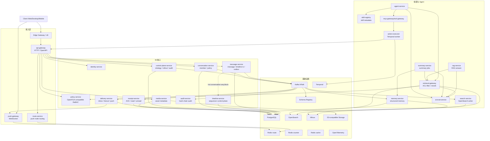

# NexusIM 目标态技术架构 v1.1

## 1. 架构定位

NexusIM 是面向大规模企业协同的 IM + 智能协作平台。核心原则是：IM 写入强一致，投递、搜索、RAG、Agent、审计全部异步化；当前以 PostgreSQL 承载交易事实源，以 Kafka 承载事件传播面，以 OpenSearch/Milvus 作为检索投影候选，以工作流引擎承接审批、补偿和 Agent 长事务。

不可退让项：

- `seq + message + timeline + outbox` 在普通会话中本地事务提交。
- 核心事实事件必须走契约化事件平台和 outbox relay；当前实现使用 Kafka。
- Redis 只保存热状态和路由，不作为消息、ACK、权限事实源。
- push-gateway 只维护连接和推送，不写消息事实源。
- search-service 是搜索索引唯一写入口；具体搜索中间件可按 ADR 替换。
- retrieval-gateway 是全文/向量检索唯一入口；具体检索后端可按 ADR 替换。
- Agent 写动作必须 `Proposal -> Approval -> Executor -> Audit`。
- API、事件、DB schema 必须向后兼容，数据库变更走 `expand -> migrate -> contract`。

演进边界：

- 本文只维护目标态总架构和关键技术决策。
- 服务级 SDD、Proto/OpenAPI/AsyncAPI、PostgreSQL migration、Kafka schema、压测脚本进入下一阶段工程契约，不继续并入本文。
- 核心目标态按 ADR 治理，不把快速演进中的当前实现写死成不可变终局。
- 短期工程节奏不以生产级 HA、全量压测、混沌和跨 Region 验证作为继续推进的阻塞；当前 9 个 IM 后端服务已作为可运行基础，AI 大模型应用底座已进入 collaborative-memory 算法/eval 切片。

## 2. 技术栈口径

技术栈按落地状态分层描述，任何中间件和框架都不是永久锁死；替换时必须说明兼容性、迁移、回滚和压测证据。

```text
当前已落地：Go、gRPC + Protobuf、pgx、PostgreSQL、Kafka、Redis、Docker、本地 outbox / projection / smoke 工具。
目标态推荐：Schema Registry、OpenTelemetry、mTLS、Kubernetes/GitOps、OpenSearch、S3-compatible Object Storage。
后续可替换候选：Kratos、wire、sqlc、Temporal、OpenFGA-compatible backend、Milvus 等，落地前必须通过 ADR 或服务级 SDD。
```

| 模块 | 当前推荐 / 当前实现 | 演进约束 |
| --- | --- | --- |
| 语言 | Go 1.26.4 | 业务服务和网关统一 Go |
| 微服务框架 | 当前手写 gRPC/cmd wiring，Kratos 可作为候选 | 引入框架必须减少重复 wiring，不得污染 app/domain |
| 内部通信 | gRPC + Protobuf | 服务间同步接口统一 deadline、错误码、幂等语义 |
| 外部 API | HTTP + OpenAPI | 面向客户端和开放平台 |
| WebSocket | 独立 Go push-gateway | 可用 `gobwas/ws` 或 `nhooyr.io/websocket`，不依赖重框架 |
| 数据访问 | pgx；sqlc 可作为候选 | 消息热路径不用重 ORM，SQL 契约必须可测试 |
| DI | 手写 composition root；wire 可作为候选 | 引入 DI 不能隐藏依赖方向 |
| 日志 | zap / zerolog | JSON 结构化日志 |
| 事件流 | Kafka KRaft 当前推荐 | 替换事件平台必须保持分区保序、重放和契约治理 |
| 事件契约 | Schema Registry 当前推荐 | Protobuf 优先，外围系统可用 JSON Schema |
| 事实源 | PostgreSQL 当前事实源 | 替换事实源必须证明事务、PITR、分片和回滚能力 |
| 缓存 | Redis route/counter/cache 当前推荐 | 热状态不能升级为消息、ACK、权限事实源 |
| 搜索 | OpenSearch 当前候选 | 只允许 search-service 写索引 |
| 向量 | Milvus 当前候选 | 必须支持 metadata filtering、多租户隔离和删除证明 |
| 权限 | policy-service + OpenFGA-compatible ReBAC 候选 | 业务服务不直接依赖底层授权 SDK |
| 对象存储 | S3-compatible Object Storage | 元数据在 PostgreSQL，内容在对象存储 |
| 长事务 | Temporal / workflow engine 候选 | 审批、补偿、Retention、Agent 写动作不能进入 IM 热路径 |
| 可观测性 | OpenTelemetry + Prometheus + Grafana + Tempo/Jaeger + Loki | trace/metric/log 统一 |
| 发布 | Kubernetes + GitOps + Argo Rollouts | canary、判稳、回滚 |
| 安全 | mTLS + NetworkPolicy + service identity | 内部 token 校验 audience |

### 2.1 分层演进策略

技术栈采用分层演进策略：稳定不变量和第一阶段必需能力，不锁死所有中间件、容量参数、部署规模和后期服务内部细节。

| 层级 | 状态 | 内容 | 变更规则 |
| --- | --- | --- | --- |
| Level 1 | 核心不变量 | 六层 DDD、gRPC + Protobuf、HTTP/OpenAPI gateway 适配、Transactional Outbox、9 个已实现后端服务的事实源 / outbox / projection 边界、Go module 和工程目录 | 变更必须走 ADR |
| Level 2 | 当前推荐方向 | PostgreSQL、Kafka、Redis、Schema Registry、OpenSearch、Kubernetes/GitOps、OpenTelemetry、S3-compatible Object Storage、mTLS | 可替换，但必须有迁移、回滚和压测证据 |
| Level 3 | 候选/待验证 | Kratos、wire、sqlc、Temporal、OpenFGA-compatible backend、Milvus、分片/副本/版本小号、HPA 参数、机器规格、RAG chunk 策略、embedding/rerank model | 由服务级 SDD、压测结果和发布评审决定 |

ADR 触发条件：

```text
改变 Level 1 不变量
改变事实源或事件平台
改变服务分层和目录约束
改变当前 9 服务主链路事实边界
改变历史事件 replay / migration / rollback 语义
```

ADR 必须说明：

```text
变更原因
影响的服务和契约
数据迁移或事件兼容方案
历史事件 replay 方案
压测或验证结果
回滚方案
```

依赖小版本升级不属于大架构变更，但必须走依赖升级流程，保留兼容性测试和回滚记录。

## 3. 总体拓扑



## 4. 服务边界

目标态核心服务清单是演进蓝图，不等同当前已实现快照，也不是服务数量上限。新增服务和中间件不写死，必须满足独立数据模型、独立伸缩需求、独立故障边界、独立安全边界之一，或能显著降低现有服务复杂度，并通过 ADR。当前已独立实现的 `contacts-service` 正式纳入核心服务，不再把它隐含到 conversation-service。

当前事实和目标态分层如下：

| 分层 | 当前口径 |
| --- | --- |
| 已实现后端主链路 | `api-gateway`、`identity-service`、`message-service`、`conversation-service`、`delivery-service`、`push-gateway`、`receipt-service`、`contacts-service`、`policy-service` |
| 下一阶段 AI 底座主线 | `search-service v0.1`、`memory-service`、`retrieval-gateway`、`rag-service`、`summary-service`、`agent-service`、`skill-registry`、`mcp-gateway/tool-gateway`、`action-executor` |
| 目标态候选 / 后置平台能力 | `route-service`、`control-plane-service`、`timeline-service`、`media-service`、`notification-service`、`audit-service`、`admin-service`、`presence-service`、`model-gateway`、`workflow-service`、`knowledge-ingestion-service`、`vector-index-service` 等按 ADR 渐进拆分 |

| 层级 | 组件 |
| --- | --- |
| 接入层 | `api-gateway`、`route-service`、`push-gateway` |
| IM 核心 | `identity-service`、`policy-service`、`control-plane-service`、`conversation-service`、`contacts-service`、`message-service`、`timeline-service`、`delivery-service`、`receipt-service`、`push-gateway`、`presence-service`、`media-service`、`notification-service`、`audit-service`、`admin-service` |
| 检索与 Agent 智能层 | `search-service`、`memory-service`、`retrieval-gateway`、`rag-service`、`summary-service`、`agent-service`、`skill-registry`、`mcp-gateway/tool-gateway`、`action-executor`、`ai-eval-service`、`model-gateway`、`workflow-service`、`knowledge-ingestion-service`、`vector-index-service` |

| 服务 | 数据归属 | 核心职责 | 禁止事项 |
| --- | --- | --- | --- |
| api-gateway | 无长期业务数据 | HTTP/OpenAPI 入口、认证上下文、命令转发 | 不写业务事实源、不做长事务编排 |
| route-service | push route projection、Redis route | 为客户端选择 push-gateway 节点、路由刷新 | 不维护 WebSocket 连接、不写消息事实 |
| push-gateway | 连接状态 | 建连、鉴权、心跳、在线推送、慢连接剔除 | 不写 message_log、不分配 seq、不改已读 |
| identity-service | 用户、设备、session、角色 | 登录、刷新、吊销、身份上下文 | 不承载业务权限细节 |
| policy-service | relation tuples、授权模型 | ReBAC 判定、权限缓存、strict check | 业务服务不直连底层 OpenFGA |
| control-plane-service | 策略配置、版本、rollout、审批记录 | sequencer、fanout、partition mapping、预算、降级、feature flag | 不允许人工改 DB 绕过控制面 |
| conversation-service | 会话、成员、策略、成员变更 Saga | 成员事实、权限版本、成员边界命令 | 不写消息正文 |
| contacts-service | contacts、blocks、relationship projection | 联系人、黑名单、关系事件 | 不做会话成员事实、不绕过 policy-service |
| message-service | message_log、timeline、message_outbox | 普通会话单事务写 `seq + message + timeline + outbox` | 不做投递、搜索、RAG |
| timeline-service | sequencer state、seq block、gap marker | 热点会话 seq block、leader fencing、gap marker | 普通会话不拆散 message 本地事务 |
| delivery-service | user_inbox、delivery task | fanout、离线补拉、在线推送触发 | 不推进 read cursor |
| receipt-service | delivery ACK、read cursor、unread projection | ACK、已读、未读聚合 | 不改消息事实 |
| presence-service | presence_sessions、typing state | 在线状态、输入中、最后在线和设备在线投影 | 不作为消息投递或权限事实源 |
| media-service | media_objects、scan_jobs | 上传、扫描、短期 URL | 不绕过权限下载 |
| notification-service | notification_requests、delivery attempts | email、SMS、APNs/FCM、模板、bounce handling | 不保存验证码或 provider body 明文 |
| search-service | search index | 产品搜索索引唯一写入口 | 其他服务不直写搜索后端 |
| memory-service | structured memory、profile aggregate、memory graph | 结构化记忆、版本语义、画像聚合和跨群归因 | 不作为消息事实源、不替代 policy-service |
| retrieval-gateway | evidence_pack、retrieval audit | 权限过滤、混合检索、rerank、EvidencePack | Agent/前端不直连索引 |
| rag-service | rag_sessions、answer audit、prompt/model refs | 基于 EvidencePack 生成带引用回答或拒答 | 不直接读索引、不无证据回答 |
| summary-service | summary_jobs、summary_versions、source refs | 会话/项目/任务摘要和删除后重算 | 不把摘要当事实源 |
| agent-service | agent_runs、proposals | 只读问答、计划、写动作提案 | 不直接写业务库、不直接执行高风险工具 |
| skill-registry | skill metadata、tool schema、risk labels | 技能目录、schema 版本、owner 和风险策略 | 不执行工具、不保存业务事实 |
| mcp-gateway/tool-gateway | tool_call_log、tool route config | MCP/内部工具调用入口、schema 校验、tool policy、调用路由 | 不绕过 policy/approval 执行高风险动作 |
| action-executor | action_execution_attempts、Temporal workflow state | 执行低风险 allowlist 或已审批动作、调用公开业务 API、写执行结果 | 不接收未授权高风险动作、不绕过业务 API |
| ai-eval-service | eval datasets、eval runs、failure records | 权限、证据、时间版本、tool policy 和模型/prompt/retrieval 变更门禁 | 不参与线上热路径 |
| model-gateway | provider config、cost audit | 模型 provider、embedding、rerank、fallback、成本和低敏审计 | 不拥有 IM 事实或 Agent approval |
| workflow-service | workflow state、approval wait、compensation state | 长事务、审批等待、retention、repair 和外部补偿 | 不进入 IM 热路径 |
| knowledge-ingestion-service | ingestion jobs、chunk manifests | 文件 / 网页 / 知识库导入、chunking、embedding pipeline | 不绕过 media / policy / retrieval 边界 |
| vector-index-service | vector refs、index rebuild jobs | 向量写入、重建、backfill 和 delete proof | 不作为 retrieval 入口 |
| audit-service | audit_logs、audit_manifest | 不可变审计、导出、修复留痕 | 不作为业务状态源 |

当前态 vs 目标态：

| 范围 | 当前状态 | 后续差距 |
| --- | --- | --- |
| 9 个主链路服务 | `api-gateway`、`identity`、`message`、`conversation`、`delivery`、`push`、`receipt`、`contacts`、`policy` 已有真实链路或最小闭环 | 短期补齐 AI 依赖的必要 IM 语义、安全边界、事件契约和本地可验证闭环；生产级治理、故障验证和容量基线作为后续加固项 |
| 本地/双机分布式 | Win/Mac Docker smoke 已验证跨实例 route、resume、PullInbox fallback | Kafka HA、PostgreSQL failover、Redis quorum / 网络分区、K8s rollout 未验证，但不阻塞先进入 AI 大模型应用底座 |
| 后续新增服务 | AI 层以 search、memory、retrieval、RAG、summary、Agent、skill、tool、executor、eval 为基线方向 | 不预设最终数量；满足拆分准则并通过 ADR 后再立项，不一次性拆碎 |

工程分层约定为：

```text
api -> app -> domain
trigger -> app -> domain
app -> infrastructure
app/domain/api/trigger -> types
```

六层职责基线：

| 层 | 职责 | 示例 |
| --- | --- | --- |
| `api` | 对外接口适配层 | gRPC handler、HTTP handler、request/response 转换 |
| `app` | 应用用例层 | `SendMessageUseCase`、事务编排、调用 domain 和 infrastructure |
| `domain` | 领域规则层 | `Message`、`TimelineEvent`、`OutboxEvent`、幂等规则、状态流转 |
| `infrastructure` | 基础设施实现层 | PostgreSQL、Kafka、Redis、外部 RPC client、SQL repository |
| `types` | 类型定义层 | Command、DTO、枚举、错误码、常量、跨层轻量类型 |
| `trigger` | 触发器 / 后台任务层 | Outbox Relay、Kafka consumer、定时巡检、补偿任务 |

依赖方向基线：

```text
api -> app
api -> types
trigger -> app
trigger -> types
app -> domain
app -> infrastructure
app -> types
domain -> types
infrastructure -> domain
infrastructure -> types
```

禁止方向：

```text
domain -> infrastructure
domain -> api
domain -> trigger
app -> concrete SDK without infrastructure port
infrastructure -> api
infrastructure -> trigger
types -> app/domain/infrastructure/api/trigger
```

领域层不依赖 Kafka、Redis、SQL、OpenSearch、Milvus、Temporal SDK。
`infrastructure -> domain` 仅用于 repository / publisher adapter 实现时转换领域输入、结果或领域对象；`domain -> infrastructure` 仍然禁止。
`app -> infrastructure` 仅用于当前轻量骨架和组合根过渡；正式实现优先由 `app` 定义 port，由 `cmd` / composition root 注入 infrastructure 实现。

### 4.1 Control Plane

运行策略统一由 control-plane-service 管理，禁止人工直接改业务表或配置文件。

管理范围：

```text
sequencer 模式切换
fanout mode 切换
Kafka virtual partition mapping
tenant budget
feature flag
降级策略
ACL strict mode
RAG/Agent policy
```

控制面命令流：

```text
control command
-> policy check
-> approval if required
-> write config_version
-> rollout by scope
-> emit control-plane event
-> audit
```

控制面事实表：

| 表 | 主键 | 职责 |
| --- | --- | --- |
| control_plane_configs | `config_key + version` | 策略版本和配置内容 |
| control_plane_rollouts | `rollout_id` | 灰度范围、状态、失败原因 |
| control_plane_applied_versions | `service_name + instance_id + config_key` | 服务实例已应用配置版本 ACK |
| control_plane_audits | `audit_id` | 策略变更审计 |

Rollout 判稳：

```text
target scope 99% instances applied config_version
and critical services report no apply error
and core SLO has no regression
```

