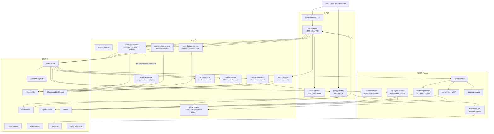

# NexusIM 目标态技术架构冻结稿 v1.0

## 1. 架构定位

NexusIM 是面向大规模企业协同的 IM + 智能协作平台。核心原则是：IM 写入强一致，投递、搜索、RAG、Agent、审计全部异步化；PostgreSQL 是交易事实源，Kafka 是事件传播面，OpenSearch/Milvus 是检索投影面，Temporal 承接审批、补偿和 Agent 长事务。

不可退让项：

- `seq + message + timeline + outbox` 在普通会话中本地事务提交。
- Kafka 是唯一核心事件流平台，事件契约进入 Schema Registry。
- Redis 只保存热状态和路由，不作为消息、ACK、权限事实源。
- push-gateway 只维护连接和推送，不写消息事实源。
- search-service 是 OpenSearch 唯一写入口。
- retrieval-gateway 是搜索和向量检索唯一入口。
- Agent 写动作必须 `Proposal -> Approval -> Executor -> Audit`。
- API、事件、DB schema 必须向后兼容，数据库变更走 `expand -> migrate -> contract`。

冻结边界：

- 本文只维护目标态总架构和关键技术决策。
- 服务级 SDD、Proto/OpenAPI/AsyncAPI、PostgreSQL migration、Kafka schema、压测脚本进入下一阶段工程契约，不继续并入本文。
- v1.0 冻结后不再新增总架构章节；后续变更只允许修正文档错误或补充已冻结决策的歧义。

## 2. 冻结技术栈

| 模块 | 技术方案 | 约束 |
| --- | --- | --- |
| 语言 | Go 1.26.4 | 业务服务和网关统一 Go |
| 微服务框架 | Kratos | 业务微服务统一 Kratos |
| 内部通信 | gRPC + Protobuf | 服务间同步接口统一 deadline、错误码、幂等语义 |
| 外部 API | HTTP + OpenAPI | 面向客户端和开放平台 |
| WebSocket | 独立 Go push-gateway | 可用 `gobwas/ws` 或 `nhooyr.io/websocket`，不依赖重框架 |
| 数据访问 | pgx + sqlc | 消息热路径不用 ORM |
| DI | wire | 编译期依赖注入 |
| 日志 | zap / zerolog | JSON 结构化日志 |
| 事件流 | Kafka KRaft | 使用 KRaft 元数据模式 |
| 事件契约 | Confluent Schema Registry | Protobuf 优先，外围系统可用 JSON Schema |
| 事实源 | PostgreSQL 分区/分片集群 | PITR、主从、分区裁剪、热点分片 |
| 缓存 | Redis route/counter/cache 三类集群 | 连接路由、计数聚合、普通缓存隔离 |
| 搜索 | OpenSearch | 全文、混合检索、冷热索引 |
| 向量 | Milvus | 大规模 ANN、metadata filtering、多租户隔离 |
| 权限 | policy-service + OpenFGA-compatible ReBAC | 业务服务不直接依赖 OpenFGA SDK |
| 对象存储 | S3-compatible Object Storage | 元数据在 PostgreSQL，内容在对象存储 |
| 长事务 | Temporal | 审批、补偿、Retention、Agent 写动作 |
| 可观测性 | OpenTelemetry + Prometheus + Grafana + Tempo/Jaeger + Loki | trace/metric/log 统一 |
| 发布 | Kubernetes + GitOps + Argo Rollouts | canary、判稳、回滚 |
| 安全 | mTLS + NetworkPolicy + service identity | 内部 token 校验 audience |

### 2.1 分层冻结策略

技术栈冻结采用分层策略：冻结方向和第一阶段必需技术，不冻结所有容量参数、部署规模和后期服务内部细节。

| 层级 | 状态 | 内容 | 变更规则 |
| --- | --- | --- | --- |
| Level 1 | 硬冻结 | Go、Kratos、六层 DDD、gRPC + Protobuf、HTTP/OpenAPI gateway 适配、pgx + sqlc、PostgreSQL 事实源、Kafka + Schema Registry、Transactional Outbox、`message-service SendMessage` 第一阶段主链路、Go module 和工程目录 | 变更必须走 ADR |
| Level 2 | 软冻结 | Redis route/counter/cache 拆分、OpenSearch、Milvus、Temporal、Kubernetes + GitOps + Argo Rollouts、OpenTelemetry 体系、S3-compatible Object Storage | 方向冻结；服务级 SDD、压测和 ADR 可以细化实现 |
| Level 3 | 暂不冻结 | Kafka partition 数、PostgreSQL shard 数、Redis shard 数、具体版本小号、HPA 参数、服务副本数、机器规格、OpenSearch mapping 细节、Milvus index 类型、RAG chunk 策略、embedding/rerank model | 由服务级 SDD、压测结果和发布评审决定 |

ADR 触发条件：

```text
替换 Level 1 技术
改变事实源或事件平台
改变服务分层和目录约束
改变 message-service 第一阶段主链路
改变历史事件 replay / migration / rollback 语义
```

ADR 必须说明：

```text
变更原因
影响的服务和契约
数据迁移或事件兼容方案
历史事件 replay 方案
压测或验证结果
回滚方案
```

依赖小版本升级不属于大架构变更，但必须走依赖升级流程，保留兼容性测试和回滚记录。

## 3. 总体拓扑



## 4. 服务边界

目标态服务 / 网关组件冻结为 20 个，不继续新增服务；后续只做服务级 SDD、契约、Schema 和压测落地。

| 层级 | 组件 |
| --- | --- |
| 接入层 | `api-gateway`、`route-service`、`push-gateway` |
| IM 核心 | `identity-service`、`policy-service`、`control-plane-service`、`conversation-service`、`message-service`、`timeline-service`、`delivery-service`、`receipt-service`、`media-service`、`audit-service` |
| 检索与 Agent 智能层 | `search-service`、`rag-ingest-service`、`retrieval-gateway`、`agent-service`、`tool-service`、`approval-service`、`action-executor` |

| 服务 | 数据归属 | 核心职责 | 禁止事项 |
| --- | --- | --- | --- |
| api-gateway | 无长期业务数据 | HTTP/OpenAPI 入口、认证上下文、命令转发 | 不写业务事实源、不做长事务编排 |
| route-service | push route projection、Redis route | 为客户端选择 push-gateway 节点、路由刷新 | 不维护 WebSocket 连接、不写消息事实 |
| push-gateway | 连接状态 | 建连、鉴权、心跳、在线推送、慢连接剔除 | 不写 message_log、不分配 seq、不改已读 |
| identity-service | 用户、设备、session、角色 | 登录、刷新、吊销、身份上下文 | 不承载业务权限细节 |
| policy-service | relation tuples、授权模型 | ReBAC 判定、权限缓存、strict check | 业务服务不直连底层 OpenFGA |
| control-plane-service | 策略配置、版本、rollout、审批记录 | sequencer、fanout、partition mapping、预算、降级、feature flag | 不允许人工改 DB 绕过控制面 |
| conversation-service | 会话、成员、策略、成员变更 Saga | 成员事实、权限版本、成员边界命令 | 不写消息正文 |
| message-service | message_log、timeline、message_outbox | 普通会话单事务写 `seq + message + timeline + outbox` | 不做投递、搜索、RAG |
| timeline-service | sequencer state、seq block、gap marker | 热点会话 seq block、leader fencing、gap marker | 普通会话不拆散 message 本地事务 |
| delivery-service | user_inbox、delivery task | fanout、离线补拉、在线推送触发 | 不推进 read cursor |
| receipt-service | delivery ACK、read cursor、unread projection | ACK、已读、未读聚合 | 不改消息事实 |
| media-service | media_objects、scan_jobs | 上传、扫描、短期 URL | 不绕过权限下载 |
| search-service | OpenSearch index | 产品搜索索引唯一写入口 | 其他服务不直写 OpenSearch |
| rag-ingest-service | rag_sources、rag_chunks、embedding_jobs | chunk、embedding、删除同步 | 不参与消息热路径 |
| retrieval-gateway | evidence_pack、retrieval audit | 权限过滤、混合检索、rerank、EvidencePack | Agent/前端不直连索引 |
| agent-service | agent_runs、proposals | 只读问答、写动作提案 | 不直接写业务库 |
| tool-service | tool_registry、tool_call_log | MCP 工具注册、鉴权、调用路由 | 不绕过 approval 执行高风险动作 |
| approval-service | approval_tasks、decisions | 审批、升级、超时 | 不跳过审计 |
| action-executor | action_execution_attempts、Temporal workflow state | 执行已审批动作、调用工具或内部 API、写执行结果 | 不接收未审批写动作、不绕过业务 API |
| audit-service | audit_logs、audit_manifest | 不可变审计、导出、修复留痕 | 不作为业务状态源 |

工程分层固定为：

```text
api -> app -> domain
trigger -> app -> domain
app -> infrastructure
app/domain/api/trigger -> types
```

六层职责固定为：

| 层 | 职责 | 示例 |
| --- | --- | --- |
| `api` | 对外接口适配层 | gRPC handler、HTTP handler、request/response 转换 |
| `app` | 应用用例层 | `SendMessageUseCase`、事务编排、调用 domain 和 infrastructure |
| `domain` | 领域规则层 | `Message`、`TimelineEvent`、`OutboxEvent`、幂等规则、状态流转 |
| `infrastructure` | 基础设施实现层 | PostgreSQL、Kafka、Redis、外部 RPC client、sqlc repo |
| `types` | 类型定义层 | Command、DTO、枚举、错误码、常量、跨层轻量类型 |
| `trigger` | 触发器 / 后台任务层 | Outbox Relay、Kafka consumer、定时巡检、补偿任务 |

依赖方向固定为：

```text
api -> app
api -> types
trigger -> app
trigger -> types
app -> domain
app -> infrastructure
app -> types
domain -> types
infrastructure -> domain
infrastructure -> types
```

禁止方向：

```text
domain -> infrastructure
domain -> api
domain -> trigger
app -> concrete SDK without infrastructure port
infrastructure -> api
infrastructure -> trigger
types -> app/domain/infrastructure/api/trigger
```

领域层不依赖 Kafka、Redis、SQL、OpenSearch、Milvus、Temporal SDK。
`infrastructure -> domain` 仅用于 repository / publisher adapter 实现时转换领域输入、结果或领域对象；`domain -> infrastructure` 仍然禁止。
`app -> infrastructure` 仅用于当前轻量骨架和组合根过渡；正式实现优先由 `app` 定义 port，由 `cmd` / composition root 注入 infrastructure 实现。

### 4.1 Control Plane

运行策略统一由 control-plane-service 管理，禁止人工直接改业务表或配置文件。

管理范围：

```text
sequencer 模式切换
fanout mode 切换
Kafka virtual partition mapping
tenant budget
feature flag
降级策略
ACL strict mode
RAG/Agent policy
```

控制面命令流：

```text
control command
-> policy check
-> approval if required
-> write config_version
-> rollout by scope
-> emit control-plane event
-> audit
```

控制面事实表：

| 表 | 主键 | 职责 |
| --- | --- | --- |
| control_plane_configs | `config_key + version` | 策略版本和配置内容 |
| control_plane_rollouts | `rollout_id` | 灰度范围、状态、失败原因 |
| control_plane_applied_versions | `service_name + instance_id + config_key` | 服务实例已应用配置版本 ACK |
| control_plane_audits | `audit_id` | 策略变更审计 |

Rollout 判稳：

```text
target scope 99% instances applied config_version
and critical services report no apply error
and core SLO has no regression
```

## 5. 消息写入与 Timeline

### 5.1 普通会话写入

普通会话保持最短本地事务链路：

```text
api-gateway
-> message-service validate auth and permission projection
-> PostgreSQL tx:
     allocate conversation_seq by row lock
     insert message_log
     insert conversation_timeline_events
     insert message_outbox
-> return message_id + conversation_seq
-> outbox relay publishes message.persisted to Kafka
```

该模式保住核心不变量：

```text
message_log、timeline、outbox 不出现跨服务半成功。
```

### 5.2 热点会话写入

热点会话由 timeline-service 提供 sequencer control-plane：

```text
hot conversation detected
-> timeline-service leader owns conversation
-> leader pre-allocates seq block
-> message-service gets seq from local block cache
-> message-service tx writes message_log + timeline + outbox
```

Seq 模式状态机：

```text
LOCAL_ROW_LOCK
-> PROMOTING_TO_SEQUENCER
-> SEQUENCER_BLOCK
-> DEMOTING_TO_LOCAL
-> LOCAL_ROW_LOCK
```

升级协议：

```text
control-plane marks conversation PROMOTING_TO_SEQUENCER
-> message-service queues or rate-limits this conversation
-> timeline-service reads current next_seq
-> timeline-service creates sequencer_epoch
-> timeline-service allocates first seq block
-> control-plane switches mode to SEQUENCER_BLOCK
-> message-service refreshes block cache
```

降级协议：

```text
control-plane marks DEMOTING_TO_LOCAL
-> stop issuing new seq block
-> drain message-service block cache
-> mark unused seq as gap marker
-> persist next_seq to conversation_seq
-> switch mode to LOCAL_ROW_LOCK
```

timeline-service 不接管普通消息事务，只负责：

- 热点识别；
- sequencer leader election；
- seq block 分配；
- epoch fencing；
- gap marker；
- owner 切换审计。

Sequencer 实现固定为：

| 能力 | 技术 |
| --- | --- |
| 选主 | Kubernetes Lease |
| fencing | PostgreSQL `sequencer_epoch` |
| seq block 状态 | PostgreSQL |
| 热点状态缓存 | Redis counter/cache |
| leader 审计 | audit-service |

Seq 规则：

- 允许有系统解释的 gap，不允许乱序。
- leader 崩溃后未使用 seq 作废，并写 `TimelineGapMarker`。
- 客户端遇到 gap marker 不阻塞后续展示。
- 补拉接口返回 gap marker，客户端不重试不存在的 seq。

### 5.3 Timeline Append / Publish 顺序

所有进入 `conversation.timeline.events` 的事件必须共享同一 conversation 顺序轴：

```text
message.persisted / edited / revoked / deleted
conversation.member.joined / left / role_changed
boundary event
gap marker
repair event
```

目标态原则：

```text
所有 conversation timeline event 必须经过同一个 append / publish ordering mechanism。
```

允许的实现路线：

| 方案 | 说明 | 适用性 |
| --- | --- | --- |
| A | conversation-service 只提交 boundary command，最终由 timeline authority 统一写 timeline + outbox | 推荐用于热点和成员边界复杂场景 |
| B | 多服务各写 outbox，但共享 `conversation_timeline_publish_cursor` 按 `aggregate_version` 全局发布 | 可用但治理复杂 |
| C | 所有 timeline event 进入同一张 `conversation_timeline_events` 和同一条 outbox 流 | 推荐用于第一批生产化 |

第一阶段只有 message-service 产生 message timeline event，因此 message-service outbox 顺序保护足够。成员边界、gap marker 和 repair event 生产化前，`conversation-service / member_change_saga SDD` 必须选定 A/B/C 之一。

热点 seq 分配流水：

```text
seq_allocation_journal:
  tenant_id
  conversation_id
  sequencer_epoch
  seq
  allocation_id
  allocated_to
  status: ALLOCATED / COMMITTED / GAP_MARKED
  allocated_at
  committed_at
  gap_marked_at
  reason
```

约束：

- message-service 从 block cache 取 seq 时写 `ALLOCATED`。
- 本地事务提交成功后标记 `COMMITTED`。
- 事务失败、实例崩溃、block 作废时标记 `GAP_MARKED` 并写 gap marker。
- 巡检任务告警长时间停留在 `ALLOCATED` 的 seq。
- journal 用于证明无重复 seq、无未解释 gap。

### 5.4 消息变更

编辑、撤回、删除流程：

```text
operator request
-> message-service validate permission
-> PostgreSQL tx: update message_log + message_change_history + timeline + outbox
-> Kafka: message.edited / revoked / deleted
-> delivery updates inbox visibility
-> search updates/deletes OpenSearch document
-> rag deletes/rebuilds chunks and vectors
-> audit appends immutable record
```

删除和撤回对用户侧只返回 tombstone，不返回旧正文。

## 6. 成员边界与 Fanout

### 6.1 成员变更 Saga

成员事实由 conversation-service 拥有。成员边界必须进入 timeline，并通过显式 Saga 管理失败窗口。

`member_change_saga`：

```text
change_id
tenant_id
conversation_id
user_id
change_type
boundary_seq
status
idempotency_key
expected_member_version
command_hash
operator_id
conflict_policy
retry_count
last_error
created_at
updated_at
```

状态机：

```text
PENDING_BOUNDARY
-> BOUNDARY_ALLOCATED
-> MEMBER_UPDATED
-> EVENT_PUBLISHED
-> DONE

any state -> FAILED_COMPENSATED
```

协议：

```text
conversation-service receives member command
-> create member_change_saga(PENDING_BOUNDARY)
-> allocate boundary_seq
-> update conversation_members(join_seq / leave_seq / permission_version)
-> publish conversation.member.*
-> update search/rag ACL projection
-> audit
```

失败补偿：

| 失败点 | 补偿 |
| --- | --- |
| boundary 分配失败 | saga 失败，成员表不变 |
| boundary 已分配但成员更新失败 | 写 boundary cancelled，审计失败原因 |
| 成员已更新但事件发布失败 | outbox 重试，超限进 DLQ |
| ACL 投影失败 | retrieval-gateway 进入 `strict_acl_mode` 回源校验 |

并发规则：

- 同一 `idempotency_key` 重试返回同一 `change_id`。
- 同一 `conversation_id + user_id` 的成员变更串行化。
- `conversation_members.member_version` 做乐观并发控制。
- 加入中又退出、退群中又改角色时，按 `conflict_policy` 拒绝、合并或补偿。
- 所有冲突结果写入 saga 和 audit。

### 6.2 Fanout 状态机

每条 timeline event 固化 `fanout_mode` 和 `fanout_policy_version`，保证重放、审计和投递异常排查可解释。

```text
WRITE_FANOUT -> HYBRID_FANOUT -> READ_FANOUT -> BROADCAST_SIGNAL
```

| 模式 | 行为 |
| --- | --- |
| WRITE_FANOUT | 为所有目标成员写 user_inbox |
| HYBRID_FANOUT | 活跃成员写 inbox，非活跃成员按 timeline 补拉 |
| READ_FANOUT | 不做全量 inbox 写扩散，客户端按 timeline 拉取 |
| BROADCAST_SIGNAL | 只推送新消息信号，内容按需拉取 |

切换条件：

```text
member_count
active_member_count
msg_qps_1m
fanout_lag_seconds
inbox_write_amplification
push_success_rate
redis_hot_key_score
delivery_consumer_lag
```

新 mode 只影响新 timeline event，旧 event 按固化 mode 继续处理。

## 7. 数据模型

核心表：

| 表 | 主键/唯一键 | 职责 |
| --- | --- | --- |
| conversation_seq | `tenant_id + conversation_id` | 普通会话 seq |
| conversation_sequencer_state | `tenant_id + conversation_id` | 热点会话 owner、epoch、seq block |
| seq_allocation_journal | `tenant_id + conversation_id + seq` | 热点 seq 分配、提交、gap 标记流水 |
| timeline_gap_markers | `tenant_id + conversation_id + gap_start` | seq gap 解释 |
| message_log | `tenant_id + conversation_id + conversation_seq` | 消息事实源 |
| conversation_timeline_events | `tenant_id + conversation_id + seq` | 会话顺序轴 |
| message_outbox | `event_id` | 待发布事件 |
| conversation_members | `tenant_id + conversation_id + user_id` | 成员、join_seq、leave_seq、permission_version |
| member_change_saga | `change_id` | 成员边界 Saga |
| conversation_fanout_state | `tenant_id + conversation_id` | fanout mode |
| user_inbox | `tenant_id + user_id + conversation_id + seq` | durable delivery index |
| device_delivery_cursors | `tenant_id + user_id + device_id + conversation_id` | 设备 ACK |
| conversation_read_cursors | `tenant_id + user_id + conversation_id` | 用户已读 |
| control_plane_configs | `config_key + version` | 控制面配置版本 |
| control_plane_rollouts | `rollout_id` | 策略灰度和回滚状态 |
| control_plane_applied_versions | `service_name + instance_id + config_key` | 服务实例已应用配置版本 ACK |
| kafka_partition_mappings | `topic + mapping_version + virtual_partition` | virtual partition 到 physical partition 映射 |
| acl_relation_tuples | `tenant_id + subject + relation + resource` | ReBAC 事实 |
| acl_projection_versions | `tenant_id + resource_id` | 索引/向量权限投影版本 |
| rag_chunks | `tenant_id + chunk_id` | chunk 元数据和向量归因 |
| delete_proofs | `tenant_id + delete_proof_id` | 删除证明 |
| audit_logs | `tenant_id + audit_id` | 审计记录 |
| audit_manifests | `tenant_id + manifest_date` | 审计 hash manifest |
| tenant_budgets | `tenant_id + budget_type` | 租户预算 |
| ai_eval_datasets | `dataset_id + version` | AI safety 评测集版本 |
| ai_eval_runs | `run_id` | 评测执行记录 |

关键约束：

- 所有业务表必须包含 `tenant_id`。
- `message_log` 唯一键：`tenant_id + sender_id + device_id + client_msg_id`，并保存 `command_hash` 用于判断重复请求是否语义一致。
- `client_msg_id` 是 device scoped globally unique UUID，同一 `tenant_id + sender_id + device_id` 下不能跨会话复用。
- `conversation_seq` 由 conversation-service 创建会话时初始化；message-service 只允许幂等兜底补建并记录 metric / repair log。
- `conversation_timeline_events` 唯一键：`tenant_id + conversation_id + seq`。
- outbox relay 使用 `FOR UPDATE SKIP LOCKED`。
- outbox relay 对同一 `tenant_id + conversation_id` 必须按 `aggregate_version` 严格发布；存在更小版本的 `PENDING` 或 `DLQ` 事件时，不允许发布后续事件。
- 消费者先完成持久化副作用，再提交 Kafka offset。
- Redis 中的状态必须能从 PostgreSQL/Kafka 重建。

## 8. Kafka 事件平台

Kafka 使用 KRaft 模式，核心配置：

```text
replication.factor = 3
min.insync.replicas = 2
producer.acks = all
producer.enable.idempotence = true
schema compatibility = BACKWARD_TRANSITIVE
shared long-lived events = FULL_TRANSITIVE
```

Topic 规划：

| Topic | 分区键 | 保留 | 顺序 |
| --- | --- | --- | --- |
| conversation.timeline.events | `tenant_id + conversation_id` | 14 到 30 天 | 同会话严格有序 |
| im.delivery.events | `tenant_id + conversation_id` | 7 天 | 同会话有序 |
| im.receipt.events | `tenant_id + conversation_id` | 3 到 7 天 | 可按游标压缩 |
| media.asset.events | `tenant_id + asset_id` | 14 天 | 允许局部乱序 |
| agent.workflow.events | `tenant_id + agent_job_id` | 30 天 | 允许局部乱序 |
| audit.repair.events | `tenant_id + repair_id` | 长期 | 可重放 |

分区数不写死，按公式确定：

```text
partition_count = max(
  peak_topic_throughput / safe_throughput_per_partition,
  required_consumer_parallelism
)
```

建议容量档：

```text
conversation.timeline.events: 512 / 1024 / 2048
im.delivery.events: 512 / 1024
im.receipt.events: 256 / 512
```

核心 timeline topic 使用自定义分区器：

```text
virtual_partition = hash(tenant_id + conversation_id) % virtual_partition_count
physical_partition = virtual_partition_mapping[virtual_partition]
```

映射由 control-plane 管理：

```text
mapping_version
virtual_partition
physical_partition
status: ACTIVE / MIGRATING / DRAINING / ROLLED_BACK
rollout_scope
created_by
approved_by
```

约束：

- 不依赖 Kafka 默认分区策略。
- `conversation.timeline.events` 上线后不随意扩分区。
- 扩容通过 virtual partition 映射迁移，避免同一 conversation 新旧事件落点不稳定。
- producer 热加载 `mapping_version`，每条 timeline event 带 `mapping_version`。
- mapping 只追加新版本，不原地覆盖旧版本。
- 迁移期间一个 virtual partition 只能有一个 active physical partition。
- consumer lag 清零且 checksum 通过后，才能完成映射切换。
- 迁移失败回滚到上一 `mapping_version`。
- DLQ replay 必须带 `replay_id`、限速、审计，并遵守同会话 `aggregate_version` 顺序保护。

事件 envelope：

```json
{
  "event_id": "evt_01J...",
  "event_type": "message.persisted",
  "event_version": "1.0.0",
  "tenant_id": "t_001",
  "aggregate_type": "conversation",
  "aggregate_id": "conv_123",
  "aggregate_version": 1024,
  "partition_key": "t_001:conv_123",
  "trace_id": "otel-trace-id",
  "correlation_id": "req_01J...",
  "causation_id": "cmd_01J...",
  "payload": {}
}
```

timeline 事件 payload / metadata 必须携带：

```text
fanout_mode
fanout_policy_version
permission_version
classification
mapping_version
```

Replay Source Policy：

```text
事实以 PostgreSQL 为准，传播回放优先 Kafka。
```

| 场景 | 回放源 |
| --- | --- |
| Kafka 保留期内，下游投影损坏 | Kafka replay |
| Kafka 超出保留期 | PostgreSQL fact source |
| Kafka 事件疑似污染 | PostgreSQL fact source + audit.repair.events |
| message_log 被人工修复 | PostgreSQL fact source + audit.repair.events |
| search / rag 重建 | Kafka 优先，不足时回源 PostgreSQL |
| 审计复核 | audit_log + fact source |

## 9. Redis 与长连接

Redis 拆成三类集群：

| 集群 | 用途 | 降级策略 |
| --- | --- | --- |
| redis-route | WebSocket 连接路由、在线状态、session 映射 | 客户端重连恢复 |
| redis-counter | 限流、receipt 聚合、未读热点、fanout 热点 | 降低刷新频率，保留主链路 |
| redis-cache | 权限缓存、预算缓存、检索缓存 | 缓存 miss 回源 |

禁止一个 Redis 集群承载所有热状态，避免未读和限流热点拖垮连接路由。

push-gateway 只负责：

```text
connect
authenticate
heartbeat
register route
online push
slow connection eviction
disconnect cleanup
```

WebSocket 基础帧：

```json
{
  "op": "message.send",
  "request_id": "req_01",
  "client_msg_id": "cm_01",
  "conversation_id": "conv_1",
  "payload": {}
}
```

客户端约束：

```text
client_msg_id 必须是同一 device_id 下全局唯一 UUID，不能只按 conversation 维度递增或复用。
```

服务端接受：

```json
{
  "op": "message.accepted",
  "request_id": "req_01",
  "message_id": "msg_01",
  "conversation_seq": 1024
}
```

断线恢复：

```text
client reconnects with resume_token
-> push-gateway verifies session
-> client reports last_received_seq
-> delivery-service returns missing range
-> client de-duplicates by message_id and seq
-> client sends delivery.ack after local durable write
```

短断线优先走 push resume buffer：

```text
push-gateway keeps last N seconds / N messages unacked push buffer per session
client reconnects within server_push_buffer_window
-> resume from push buffer
else
-> fallback to delivery-service pull
```

约束：

- push buffer 只提升体验，不是事实源。
- buffer 丢失不影响补拉正确性。
- `server_push_buffer_window` 由 control-plane 按租户和客户端类型配置。

客户端连接状态机：

```text
DISCONNECTED
-> CONNECTING
-> AUTHENTICATING
-> CONNECTED
-> RESUMING
-> SYNCING
-> READY
-> DEGRADED
```

本地消息状态：

```text
LOCAL_PENDING
-> ACCEPTED
-> DELIVERED
-> READ

LOCAL_PENDING -> FAILED_RETRYABLE -> LOCAL_PENDING
LOCAL_PENDING -> FAILED_FINAL
```

标准错误码：

| 错误码 | 客户端动作 |
| --- | --- |
| AUTH_EXPIRED | 刷新 token 后重连 |
| DEVICE_REVOKED | 清理 session 并退出登录 |
| RATE_LIMITED | 按 `retry_after_ms` 退避 |
| CONVERSATION_NOT_FOUND | 停止重试并刷新会话 |
| PERMISSION_DENIED | 停止重试 |
| SEQ_GAP | 触发补拉 |
| SERVER_BUSY | 指数退避 |
| RETRY_AFTER | 使用服务端退避时间 |

## 10. 权限、搜索、RAG 与 Agent

### 10.1 权限模型

对外只暴露 policy-service。内部采用 OpenFGA-compatible ReBAC 模型。

```text
Subject: user / device / agent / service_account
Resource: tenant / org / conversation / message / file / chunk / tool / action
Relation: member / owner / admin / viewer / agent_delegate
Action: read / write / search / download / call_tool / approve / execute
```

授权路径：

```text
business service -> policy-service -> relation tuple store / OpenFGA-compatible engine
```

事实源边界：

| 权限事实 | 事实源 | policy-service 角色 |
| --- | --- | --- |
| user / device / session | identity-service | 消费事件构建 subject projection |
| conversation membership | conversation-service | 消费成员事件构建 relation tuples |
| tool policy | tool-service | 消费工具策略事件构建 action relation |
| approval policy | approval-service | 消费审批策略事件构建 risk relation |

policy-service 是 authorization projection + decision center，不是所有权限关系的原始事实源。

Retrieval 权限规则：

- 索引 ACL 只是加速字段，不是最终授权事实。
- retrieval-gateway 必须支持 `strict_acl_mode`。
- `acl_version` 过期、缺失或投影延迟超阈值时，必须回源 policy-service。
- 用户退群后，`leave_seq` 之后的 chunk 不能被召回。
- Agent 继承用户权限，并叠加 `agent_delegate` 与 tool policy。

强一致授权矩阵：

| 场景 | 授权方式 |
| --- | --- |
| 发消息 | 强校验 conversation-service / policy current version |
| 下载文件 | 强校验 policy-service，必要时回源 media/conversation |
| RAG 检索 | 默认 projection，`acl_version` stale 时 strict check |
| Agent 写动作 | 强校验 policy-service + approval-service |
| 普通搜索 | projection filter + 二次校验 |
| 历史补拉 | 按 `join_seq / leave_seq` 强过滤 |

Relation tuple 重建：

```text
freeze affected policy scope
-> replay identity/conversation/tool/approval events
-> rebuild relation tuples
-> compare tuple count and checksum
-> switch policy projection version
-> audit repair result
```

### 10.2 Search/RAG

OpenSearch 文档必须包含：

```text
tenant_id
org_id
conversation_id
seq
acl_scope
permission_version
deleted_at
classification
```

Milvus metadata 必须包含：

```text
tenant_id
org_id
conversation_id
source_id
chunk_id
source_event_id
source_seq
acl_version
visibility_scope
deleted_at
legal_hold
embedding_model
checksum
```

retrieval-gateway 输出 EvidencePack：

```text
evidence_pack_id
chunk_id
source_id
conversation_id
source_seq
snippet
score.recall
score.rerank
checksum
classification
trace_id
```

### 10.3 Agent 与 Temporal

Agent 写动作固定流程：

```text
agent detects write intent
-> create Action Proposal
-> approval-service checks policy and risk
-> Temporal workflow waits approval
-> action-executor calls tool-service / internal API
-> audit-service appends result
```

Temporal 只用于长事务：

- 审批等待；
- Agent 写动作；
- 文件解析补偿；
- Retention 删除；
- 跨系统工具调用补偿。

不用于发消息热路径、ACK、read cursor、普通在线投递。

## 11. 多 Region 与灾备

目标态采用：

```text
IM source of truth: Region Active-Passive
edge and push: Region Active-Active
tenant_home_region
conversation_home_region
```

写入路由：

- message write 路由到 `conversation_home_region`。
- member boundary 路由到 `conversation_home_region`。
- read/search 优先就近读投影。
- 强一致补拉回源 home region。
- Agent 写动作按资源 home region 执行。

RPO/RTO：

| 数据 | RPO | RTO | 恢复方式 |
| --- | ---: | ---: | --- |
| message_log / timeline / outbox | <= 5s / 30s | <= 15min | PostgreSQL replication + WAL |
| conversation_members | <= 5s / 30s | <= 15min | PostgreSQL replication |
| audit_logs | <= 5s | <= 30min | replication + WORM manifest |
| user_inbox | 可重建 | <= 1h | timeline replay |
| OpenSearch | 可重建 | 数小时 | Kafka/PG replay |
| Milvus | 可重建 | 数小时 | rag_chunks replay |
| Redis route | 可丢 | 客户端重连恢复 | 不跨 region 复制 |

Failback Runbook：

```text
freeze writes on recovered primary
-> compare WAL position / Kafka offsets / audit manifest
-> reconcile missing events
-> verify message_log and timeline checksum
-> switch conversation_home_region by tenant/conversation batch
-> drain old active region writes
-> resume normal routing
```

约束：

- 不允许双写窗口。
- `conversation_home_region` 切换必须由 control-plane 灰度执行。
- failback 前必须完成 message/timeline/audit 对账。
- split-brain 以 `sequencer_epoch` 和 home region fencing 拒绝写入。

## 12. 数据生命周期与审计

Retention workflow：

```text
retention scanner
-> data.expire.requested
-> message-service tombstone
-> search-service delete/update index
-> rag-ingest-service delete chunk/vector
-> media-service delete object or mark expired
-> audit-service write delete proof
-> data.expire.completed
```

规则：

- `legal_hold = true` 禁止物理删除。
- `deleted_at` 只代表用户侧不可见。
- audit_logs 不参与普通删除。
- OpenSearch/Milvus 删除必须产生 `delete_proof`。

Audit hash chain：

```text
record_hash = hash(canonical_json(record_json))
prev_hash = previous audit record hash in tenant stream
daily_manifest_hash = hash(all record_hash in day order)
```

Audit manifest 写入 WORM object storage。导出文件必须包含 record count、hash range、checksum、operator signature。

## 13. 观测、容量与成本

核心容量目标：

```text
registered users >= 3,000,000
DAU >= 500,000
peak online WebSocket >= 300,000
peak message persistence >= 50,000 msg/s
peak receipt aggregation >= 500,000 cursor/s
vector scale >= 200,000,000 chunks
Kafka replay window >= 14 days
```

容量公式：

| 资源 | 计算方式 |
| --- | --- |
| push-gateway 实例 | `peak_online_connections / safe_connections_per_instance * redundancy_factor` |
| timeline partition | `peak_timeline_events_per_sec / safe_events_per_partition` |
| message DB shard | `peak_message_writes_per_sec / safe_writes_per_shard` |
| redis-route shard | `peak_connection_route_ops / safe_ops_per_shard` |
| redis-counter shard | `peak_counter_ops / safe_ops_per_shard` |
| Kafka broker | `peak_ingress_bytes_per_sec / safe_broker_ingress`，同时满足副本和保留期容量 |
| OpenSearch data node | `index_size_hot_window / safe_disk_per_node` |
| Milvus query node | `peak_retrieval_qps / safe_qps_per_query_node` |

示例代入：

```text
push_gateway_instances
= 300,000 peak connections / 20,000 safe connections per instance * 1.5 redundancy
= 22.5 -> 24 instances

message_db_shards
= 50,000 msg/s / 5,000 safe writes per shard * 1.5 redundancy
= 15 shards

timeline_partitions
= 50,000 timeline events/s / 100 safe events per partition
= 500 -> choose 512 / 1024 capacity tier
```

核心指标：

```text
message_persist_latency_seconds
conversation_seq_alloc_latency_seconds
sequencer_leader_change_total
timeline_gap_marker_count
message_outbox_oldest_age_seconds
kafka_publish_latency_seconds
kafka_consumer_group_lag
fanout_mode_switch_total
push_queue_depth
delivery_delay_seconds
receipt_flush_lag_seconds
redis_hotkey_hits_total
acl_projection_lag_seconds
search_index_lag_seconds
embedding_backlog
retrieval_latency_seconds
approval_queue_depth
audit_hash_chain_break_total
tenant_cost_budget_usage_ratio
error_budget_burn_rate_1h
error_budget_burn_rate_6h
```

发布门禁：

```text
lint
unit / race / integration test
OpenAPI / Proto / AsyncAPI schema diff
SQL migration check
image scan / SBOM
canary 1% -> 5% -> 20% -> 50% -> 100%
SLO burn-rate check
rollback drill for core schema changes
```

成本指标：

```text
cost_per_1k_messages
embedding_cost_per_day
agent_cost_per_tenant
storage_cost_per_tenant
retrieval_cost_per_query
kafka_retention_cost_per_topic
opensearch_index_cost_per_tenant
milvus_vector_cost_per_tenant
```

超预算先限制低优先级智能任务，不影响 IM 写入主链路。

P0 Runbook 目录：

| 故障 | 首要动作 | 恢复条件 |
| --- | --- | --- |
| message 写入失败 | 冻结发布，检查 PG lock/WAL/outbox | append p99 和错误率恢复 |
| Kafka timeline 积压 | 扩 consumer，限制低优先级下游 | lag 回到基线 |
| sequencer leader 异常 | control-plane 切换 owner，检查 epoch fencing | 无乱序，gap marker 完整 |
| Redis route 故障 | 触发客户端重连和路由重建 | 在线连接恢复到阈值 |
| ACL projection 异常 | retrieval 进入 strict_acl_mode | tuple checksum 通过 |
| OpenSearch/Milvus 删除失败 | 冻结相关检索范围，重放删除事件 | delete_proof 完整 |

## 14. AI Safety Eval

RAG/Agent 发布必须跑安全评测：

| 测试 | 强验收 |
| --- | --- |
| 越权检索 | `permission_violation_rate = 0` |
| 跨租户检索 | `cross_tenant_retrieval = 0` |
| Prompt Injection | `prompt_injection_success_rate = 0` |
| 工具滥用 | `unauthorized_tool_call = 0` |
| 无审批写动作 | `high_risk_action_without_approval = 0` |
| 无证据回答 | `evidence_missing_answer_rate < threshold` |
| 错误引用 | `citation_accuracy > threshold` |

高风险评测失败阻断发布。

评测数据集管理：

| 表 | 职责 |
| --- | --- |
| ai_eval_datasets | 数据集名称、版本、owner、适用范围 |
| ai_eval_cases | 输入、期望策略、标签、风险等级 |
| ai_eval_runs | 模型、prompt、retrieval strategy、tool policy、结果 |
| ai_eval_failures | 失败样本、原因、修复状态、回流版本 |

触发规则：

- prompt template 变更必须跑 safety eval。
- retrieval strategy 变更必须跑 permission eval。
- tool schema/policy 变更必须跑 tool abuse eval。
- 线上人工纠错和事故样本必须回流到 eval dataset。

## 15. ADR

| 编号 | 决策 | 原因 |
| --- | --- | --- |
| ADR-001 | Go + Kratos 作为业务微服务栈 | 统一 HTTP/gRPC/middleware/metrics/tracing，减少框架混用 |
| ADR-002 | push-gateway 独立实现 | 长连接对性能、慢连接、背压、连接生命周期要求独立 |
| ADR-003 | PostgreSQL 是交易事实源 | 支持事务、分区、PITR、强一致写入 |
| ADR-004 | 普通消息由 message-service 单事务写 `seq + message + timeline + outbox` | 避免 timeline-service 与 message-service 跨服务事务冲突 |
| ADR-005 | timeline-service 只做 sequencer control-plane 和热点 seq authority | 保留热点扩展能力，同时不破坏普通会话本地事务 |
| ADR-006 | Sequencer 使用 Kubernetes Lease + PostgreSQL epoch fencing | Lease 负责选主，epoch 防止旧 leader 写入 |
| ADR-007 | 成员变更必须使用 member_change_saga | 显式管理成员事实和 timeline boundary 的失败窗口 |
| ADR-008 | Kafka KRaft + Schema Registry 是唯一事件平台 | 支持高吞吐、分区保序、长保留、重放和契约治理 |
| ADR-009 | Timeline topic 使用自定义 virtual partitioner | 避免扩分区导致同会话事件分区不稳定 |
| ADR-010 | Redis 拆 route/counter/cache 三类集群 | 避免连接路由被计数和缓存热点拖垮 |
| ADR-011 | policy-service 封装 OpenFGA-compatible ReBAC | 统一权限模型，避免业务服务依赖底层授权 SDK |
| ADR-012 | search-service 是 OpenSearch 唯一写入口 | 避免索引多写源造成不可控不一致 |
| ADR-013 | retrieval-gateway 是唯一检索入口 | 集中权限过滤、召回、rerank 和 EvidencePack 审计 |
| ADR-014 | Milvus 是目标向量检索层 | 支持大规模 ANN、metadata filtering 和水平扩展 |
| ADR-015 | Temporal 只承接长事务 | 避免 IM 热路径依赖工作流引擎 |
| ADR-016 | Agent 写动作必须审批和审计 | 防止模型越权和不可追踪副作用 |
| ADR-017 | Region 策略为事实源主备、接入多活 | 保证消息一致性，同时提升接入可用性 |
| ADR-018 | 审计采用 hash chain + WORM manifest | 证明审计未删除、未篡改、导出可校验 |
| ADR-019 | Retention 通过工作流执行 | 保证消息、搜索、向量、对象删除状态可证明 |
| ADR-020 | 成本治理按租户预算执行 | 控制 RAG、Agent、OpenSearch、Milvus、Kafka 单位成本 |
| ADR-021 | 引入 control-plane-service | 所有运行策略、切换、预算、降级和 feature flag 必须版本化、审批、灰度、审计 |
| ADR-022 | Sequencer 支持 LOCAL/SEQUENCER 双模式切换 | 普通会话保持本地事务，热点会话可升级到 seq block 模式 |
| ADR-023 | Kafka virtual partition mapping 由控制面版本化管理 | 支持扩容、迁移、回滚和 producer 热加载 |
| ADR-024 | policy-service 是授权投影和决策中心 | identity/conversation/tool/approval 才是各自权限事实源 |
| ADR-025 | 客户端协议定义连接状态机和本地消息状态机 | 保证断线恢复、重试、乱序和 ACK 丢失有一致语义 |
| ADR-026 | DR 必须包含 failback 和对账流程 | 防止恢复主 Region 时 split-brain 和事件丢失 |
| ADR-027 | AI eval 数据集版本化并纳入发布门禁 | 让模型、prompt、检索和工具策略变更可自动验收 |
| ADR-028 | 热点 seq 使用 seq_allocation_journal | 解释已分配未提交 seq，证明无重复 seq 和无未解释 gap |
| ADR-029 | control-plane rollout 必须收集 applied version ACK | 证明目标实例已应用配置版本，避免只发布未生效 |
| ADR-030 | Replay 遵循 PostgreSQL 事实源、Kafka 优先传播回放 | 修复时明确事实边界，避免 Kafka 与 PG 口径冲突 |
| ADR-031 | 授权按场景区分强校验和投影校验 | 在主链路、下载、Agent 写动作等高风险路径避免投影延迟误判 |
| ADR-032 | push-gateway 支持短断线 resume buffer | 提升移动端短断线体验，同时不改变 delivery 补拉事实源 |

## 16. 冻结结论与下一阶段

本文到 v1.0 为止冻结。后续不再继续堆总架构点，直接进入服务级设计、接口契约、数据库 schema、Kafka schema 和压测验证。

优先交付：

| 优先级 | 交付物 | 范围 |
| --- | --- | --- |
| P0 | `message-service SDD` | 已冻结 v1.0；发送、编辑、撤回、删除、本地事务、outbox、幂等、Runbook |
| P0 | `timeline-service / sequencer SDD` | seq block、epoch fencing、journal、gap marker、模式切换 |
| P0 | `conversation-service / member_change_saga SDD` | 成员事实、边界 seq、Saga、并发冲突、ACL 投影 |
| P0 | `Proto / OpenAPI / AsyncAPI` | `SendMessage`、`AllocateSeqBlock`、`CreateMemberChange`、`AckDelivery`、`PullOfflineMessages`、`RetrieveEvidence` |
| P0 | `PostgreSQL migration` | `conversation_seq`、`message_log`、`timeline`、`outbox`、`message_change_history`、`member_change_saga`、`inbox`、`cursor` |
| P0 | `Kafka schema and topic config` | timeline、delivery、receipt、media、agent、repair 事件和 DLQ/retry |
| P1 | `push-gateway SDD` | WebSocket 协议、resume buffer、错误码、连接状态机 |
| P1 | `delivery-service SDD` | fanout、offline pull、inbox 重建、投递延迟 |
| P1 | `retrieval-gateway SDD` | strict ACL、EvidencePack、索引版本、shadow rebuild |
| P1 | `第一轮压测脚本` | WS 建连、消息写入、热点群、补拉、ACK、Kafka lag、RAG lag、Agent approval |

当前工程缺口和代码边界：

| 缺口 | 对第一阶段代码的影响 | 边界约束 |
| --- | --- | --- |
| `timeline-service / sequencer SDD` 未完成 | 不阻塞普通会话 `SendMessage`；阻塞热点会话生产实现 | 第一阶段只实现 `LOCAL_ROW_LOCK`，`SEQUENCER_BLOCK` 只定义 port 和 mock |
| `conversation-service / member_change_saga SDD` 未完成 | 不阻塞 `GetSendContext` 会话发送上下文 read path；阻塞真实成员变更、群主/管理员规则和 ACL 投影 | message-service 只能依赖 `ConversationQueryPort`，并从 port 读取 `fanout_mode`、`fanout_policy_version`，不能写成员事实、角色规则或硬编码 fanout 策略 |
| Proto / OpenAPI / AsyncAPI 未落文件 | 阻塞正式业务代码 | 先冻结 `message_service.proto`、错误码和事件契约，再创建 service skeleton |
| PostgreSQL migration 未落文件 | 阻塞本地事务代码 | 先落 `conversation_seq + message_log + timeline + outbox` 同分片约束 |
| Kafka schema 未落文件 | 阻塞 outbox relay 对外发布 | 先落 `message.persisted.v1` 和 envelope，再实现 producer |
| Outbox DLQ repair 契约文件未落地 | 不阻塞第一阶段 `SendMessage`，但阻塞后续运维闭环 | SDD 已定义 replay/skip 语义；后续必须落 Proto/AsyncAPI 和 `audit.repair.events` schema |
| 跨服务 timeline append / publish ordering 未落地 | 不阻塞第一阶段只有 message event 的 `SendMessage`；阻塞成员边界、gap marker、repair event 生产化 | `conversation-service / member_change_saga SDD` 必须选择统一 timeline append / publish 机制 |

本地开发和双机压测配置属于运行手册，不固化在目标态架构正文中。当前机器 IP、端口、防火墙和代理约定见 `docs/runbook/local-loadtest.md`。

工程落地基线：

| 目录 | 职责 | 约束 |
| --- | --- | --- |
| `api/proto` | gRPC 服务和事件 Protobuf 契约 | 先定义 `nexusim.message.v1`，字段只增不删，破坏性变更必须升版本 |
| `api/openapi` | HTTP/OpenAPI 契约 | 由 gateway 适配生成，不能手写偏离 Proto 语义的接口 |
| `api/asyncapi` | Kafka topic 事件契约 | topic、partition key、DLQ/retry/replay policy 必须显式声明 |
| `migrations/postgres` | PostgreSQL schema migration | 按服务分目录；所有变更遵循 `expand -> migrate -> contract` |
| `schemas/kafka` | Schema Registry 输入文件 | Protobuf 为主；事件 envelope 与 outbox 表字段保持一致 |
| `services/<service>` | 服务实现 | `api / app / domain / infrastructure / types / trigger` |
| `pkg` | 跨服务公共库 | 只允许放日志、错误码、trace、配置、测试工具；禁止放业务领域模型 |
| `deploy/local` | 本地开发依赖 | PostgreSQL、Kafka、Redis 等基础设施；本地可用单 Redis namespace 简化三集群；本机端口以 runbook 为准 |
| `loadtest` | MacBook/服务器压测脚本 | 每个脚本必须写目标、参数、通过标准和结果输出路径 |

代码依赖规则：

- Go module 固定为 `github.com/qsyy0921/IM`。
- 服务之间不能直接 import 对方的 `internal` 或业务实现，只能通过 Protobuf 契约、事件契约或明确的 port interface 交互。
- `domain` 层不依赖 SQL、Kafka、Redis、OpenSearch、Milvus、Temporal、Kratos SDK。
- `app` 层只编排 use case、事务和 port interface，不写协议解析和具体存储细节。
- `infrastructure` 层承接 pgx/sqlc、Kafka producer/consumer、Redis、OpenTelemetry exporter。
- `api` 层只做对外接口适配和 request/response 转换，不写业务规则。
- `trigger` 层只做后台触发、消费、巡检和补偿任务，不写业务规则。
- `types` 层只放稳定基础类型，不允许变成全局工具箱或业务模型包。
- 第一阶段允许 `policy-service`、`conversation-service`、`timeline-service` 使用 strict mock，但 mock 必须实现同名 port，不能把权限、成员、seq 逻辑硬编码进 message-service。

第一条代码切片：

```text
message-service SendMessage
-> gRPC/HTTP contract
-> PostgreSQL migration
-> external dependency reads before DB transaction
-> local transaction: conversation_seq + message_log + conversation_timeline_events + message_outbox
-> outbox relay publishes or records publish attempt
-> integration test proves idempotency and transaction atomicity
-> service listens on configured local load-test port
-> load client runs first baseline from local-loadtest runbook
-> record SendMessage baseline before expanding service scope
```

第一阶段实现范围只包含：

```text
SendMessage
PostgreSQL local transaction
message_log
conversation_timeline_events
message_outbox
outbox relay
Kafka publish path
```

第一阶段只实现普通会话本地行锁模式：

```text
LOCAL_ROW_LOCK
```

热点会话只保留契约和 mock：

```text
SEQUENCER_BLOCK
AllocateSeqBlock port
seq_allocation_journal table contract
timeline_gap_markers table contract
```

第一阶段只定义契约、不实现业务闭环：

```text
EditMessage
RevokeMessage
DeleteMessage
hot sequencer
delivery-service
push-gateway
RAG
Agent
```

第一阶段采用边搭建边压测：

```text
small smoke load
-> SendMessage baseline
-> idempotency and conflict test
-> Kafka outage / outbox backlog test
-> short duration stability test
```

不要等 20 个目标态服务全部部署后再压测；每完成一条真实链路就记录容量基线和瓶颈。

进入编码前的门禁：

- `message-service.proto` 必须先冻结 `SendMessage`、`EditMessage`、`RevokeMessage`、`DeleteMessage` 和错误码。
- `EditMessage`、`RevokeMessage`、`DeleteMessage` request 必须携带 `conversation_id`，不能只靠 `message_id` 路由分片。
- `SendMessage` 必须明确 `command_hash` canonical 规则和 `client_msg_id` device scope。
- `SendMessage` 外部依赖读取必须在 DB transaction 外完成，事务内只做本地事实写入。
- PostgreSQL migration 必须覆盖 message-service SDD 中的核心表和唯一约束，尤其是 `conversation_seq` DDL、`message_log.command_hash` 和同分片事务约束。
- Kafka schema 必须覆盖 `message.persisted.v1`、`message.edited.v1`、`message.revoked.v1`、`message.deleted.v1`。
- `conversation.timeline.events` 的跨服务 append / publish 顺序机制必须在成员边界生产化前冻结。
- 本地集成测试必须能一键启动依赖并清理数据。
- 第一轮压测只接受真实服务进程，不接受仅返回固定字符串的 toy endpoint。

落地顺序：

```text
service SDD first
-> Proto / OpenAPI / AsyncAPI contract first
-> PostgreSQL migration first
-> Kafka schema first
-> code skeleton
-> integration test baseline
-> load test baseline
-> fault drill
```

核心验收：

- 普通会话 `seq + message + timeline + outbox` 同库同分片同事务。
- Kafka 事件契约可注册、可兼容检查、可重放。
- 客户端断线、重复发送、ACK 丢失、离线补拉均有确定协议。
- RAG/Agent 无越权检索、无审批写动作、无证据回答可被评测阻断。
- 压测输出真实容量基线和瓶颈表。
